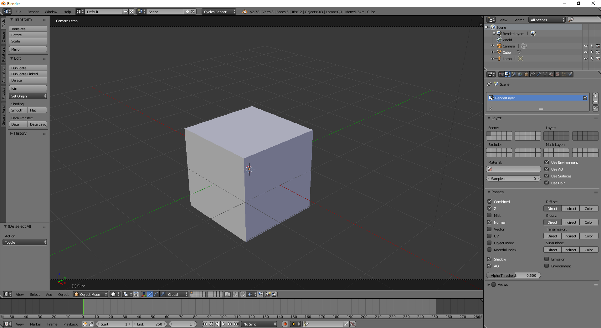
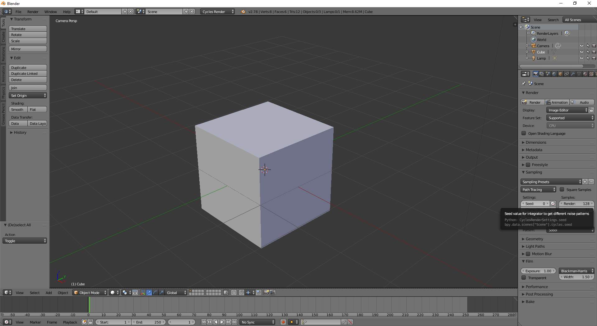

Denoise Blender Institute Cycles renders with Altus
===================================================

.. warning::

    This article is under construction and will be updated.

Overview
----------

.. include:: renderer-overview.rst

Exporting AOVs
-----------------

Recommended List of AOVs to use with Altus:

+----------------+-----------------------+-------------------------------+
| **AOV type**   | **Altus Input Name**  | **Cycles Render Pass Name**   |
+================+=======================+===============================+
| World Position | pos                   | N/A (Custom Material Required)|
+----------------+-----------------------+-------------------------------+
| Bump Normals   | nrm                   | Normal                        |
+----------------+-----------------------+-------------------------------+
| Visiblity      | vis                   | Shadow                        |
+----------------+-----------------------+-------------------------------+
| Albedo         | alb                   | Diffuse Color                 |
+----------------+-----------------------+-------------------------------+
| Reflection     | extra                 |Glossy Direct / Glossy Indirect|
+----------------+-----------------------+-------------------------------+
| Caustics       | cau (Optional)        | N/A                           |
+----------------+-----------------------+-------------------------------+

How to Output AOVs that are compatible with Altus from Blender
##############################################################

Add AOVs to save from Blender by enabling the respective Passes in the Scene tab:

This is where all the available Passes are listed.
For more information on render passes see `Render Passes in the Blender Manual`__.

__ https://docs.blender.org/manual/ja/dev/render/blender_render/settings/passes.html

.. Note::

    Some recommended AOVs are not default render passes, such as the position pass. In this case you will need to setup a custom material.

    For a guide on setting up the position AOV see `How to render a position pass in Blender Cycles`__.

__ http://vincentgires.com/blog/how-to-generate-position-pass-in-blender-cycles-or-internal/

Saving AOVs
###########

These added AOVs can be written to separate EXR images or to a multi-layer (multi-channel) EXR image.  One option to save all passes is to use the compositor to access and save the AOVs after the render is complete.

For more information on two ways to output render passes see `How can I render all render passes to files in Cycles?`__.

__ https://blender.stackexchange.com/questions/28740/how-can-i-render-all-render-passes-to-files-in-cycles

Exporting Two Buffers
----------------------

Altus requires two renders (called buffers) of the same scene to denoise properly. Cycles offers a few methods to render and save two buffers for Altus.

Render Twice
############

You can render twice and change the sample seed between renders.  Cycles has a 'sample seed' setting that will change the random seed used and will give different resulting noise patterns.

First render and save the render passes of the first buffer.  After the first render is complete, the seed must be changed. To change the seed find the Sampling panel under Render tab.  Remember: the seed must be different than the seed used to render the first buffer.

Both renders must be saved to disk along with their AOVs for Altus to use when denoising.

Render Once with Stereo
#######################

.. warning::

    This is not creating stereoscopic imagery; it is a mechanism to create the two buffers Altus needs without having to render twice.

You can render once using a stereo camera rig and Altus will divide the image into two buffers. The camera's (eye) separation should be set to 0.0 so the left and right camera's have the same location and their renders will be identical except for the noise pattern.

Cycles supports rendering stereo.  For more information see `Stereo Camera in Blender's Manual`__.

__ https://docs.blender.org/manual/en/dev/game_engine/camera/stereo.html
