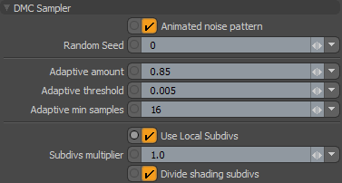

Denoise Chaos Group V-Ray renders with Altus
============================================

.. warning::

    This article is under construction and will be updated.

Overview
----------

Altus Denoiser uses information between two rendered images to generate a high quality denoised image. This guide will explain how to setup and render the inputs to Altus. There are two concepts that Altus uses to generate denoised outputs:

AOVs (Arbitrary Output Variables) provide a way to render any arbitrary shaded component into different images. Typically renderers will only produce a final color for each pixel of the image, but you can break out renders into their component parts such as indirect lighting, diffuse color, reflections, shadows, mattes, etc. and save them as AOVs individually. The denoiser quality will improve with more AOVs given as inputs to Altus.

Two images (called buffers) must be generated for each image. It's important that each buffer is rendered with a different sample seed so that they will have unique noise patterns. The variance between the two buffers is what Altus uses to remove noise. Without variance, there is not enough information to remove noise.

For information on how to run Altus once the correct inputs have been created visit:  help.innobright.com/usage/

Exporting AOVs
-----------------

Recommended List of AOVs to use with Altus:

+----------------+-----------------------+-------------------------------+
| **AOV type**   | **Altus Input Name:** | **V-Ray Render Element Name** |
+================+=======================+===============================+
| World Position | pos                   | extraTex                      |
+----------------+-----------------------+-------------------------------+
| Bump Normals   | nrm                   | Bump Normals                  |
+----------------+-----------------------+-------------------------------+
| Visiblity      | vis                   | Matte Shadows                 |
+----------------+-----------------------+-------------------------------+
| Albedo         | alb                   | Diffuse                       |
+----------------+-----------------------+-------------------------------+
| Reflection     | extra                 | Reflection                    |
+----------------+-----------------------+-------------------------------+
| Caustics       | cau (Optional)        | Caustics                      |
+----------------+-----------------------+-------------------------------+

How to Output AOVs that are compatible with Altus (from Maya)
#############################################################

Add AOVs to save from V-Ray (Maya) by opening the Render Settings Window:

.. image:: ./maya/Render_Settings_Location_Crop.png
   :scale: 60 %
   :align: center

Then switch to the Render Elements tab. This is where all the available Render Elements will be listed. Add as many elements as you prefer:  For more information on render elements see https://docs.chaosgroup.com/display/VRAY3MAYA/Render+Elements.

For a list of all render elements supported by V-Ray see https://docs.chaosgroup.com/display/VRAY3MAYA/List+of+Supported+Render+Elements.

.. Note::

	Some recommended AOVs are not default render passes, such as the position pass.  In this case you will need to setup a custom AOV with the correct information.

	For a guide on setting up the position AOV visit:  http://erwanleroy.com/create-position-reference-pref-pass-in-vray-for-maya/

Saving AOVs
###########

These added AOVs can be written to separate EXR images or to a multi-layer (multi-channel) EXR image.  Use the V-Ray Frame Buffer (VFB) to access and save these AOV's after the render is complete.

For more information on V-Ray's Frame Buffer visit: https://docs.chaosgroup.com/display/VRAY3MAYA/V-Ray+Frame+Buffer+%7C+VFB

For extra info on render elements in v-ray visit: https://docs.chaosgroup.com/display/VRAY3MAYA/Render+Elements#RenderElements-Notes

Exporting Two Buffers
----------------------

Altus requires two renders (called buffers) of the same scene to denoise properly. V-Ray offers a few methods to render and save two buffers for Altus.

Render Twice
############

You can render twice and change the sample seed between renders. Use the MEL command to change sample seed with V-Ray 3.1 and above: ``setAttr "vraySettings.dmcs_randomSeed" 0``, where 0 is the new seed to be set and can be any number.Note: (V-Ray earlier than 3.1: does support setting seeds)

.. Note::
    If you are manually setting the seed in Vray using the vray.dmcs_randomSeed setting make sure to leave enough range between seed 1 and seed 2 for the two buffers.  Vray will render to the max samples required adjusting the seed to be +1 until max. So if you have a max of 128 and a first seed of 10, at minimum you would need to set the second seed to 139 to avoid an over run of the index.
    The better option is to use a large range that cannot be encompassed by your max IE 0 and 50000.

Before rendering, ensure that Animated Noise Pattern is turned off during both renders in the Render Settings window:

After the first render is complete, the seed must be changed. The command to change seed needs to be entered in the MEL console or script window. Remember: the seed must be different than the seed used to render the first buffer.

Then type the command and press enter:

Some V-Ray plugins expose this attribute in the graphical interface such as MODO:

Both renders must be saved to disk along with their AOVs for Altus to use when denoising.

Render Once with Stereo
#######################

.. warning::

    This is not creating stereoscopic imagery; it is a mechanism to create the two buffers Altus needs without having to render twice.

You can render once using a stereo camera rig and Altus will divide the image into two buffers. The camera's (eye) separation should be set to 0.0 so the left and right camera's have the same location and their renders will be identical except for the noise pattern.

The Maya Stereo Rig is a commonly used camera rig where the stereo effect can be controlled from the Attribute Editor of the center camera inside Maya:

.. image:: ./maya/Stereo_maya.png
   :scale: 80 %
   :align: center

For more information on stereo rendering in V-Ray: https://docs.chaosgroup.com/display/VRAY3MAYA/Stereo+Rendering+with+V-Ray
