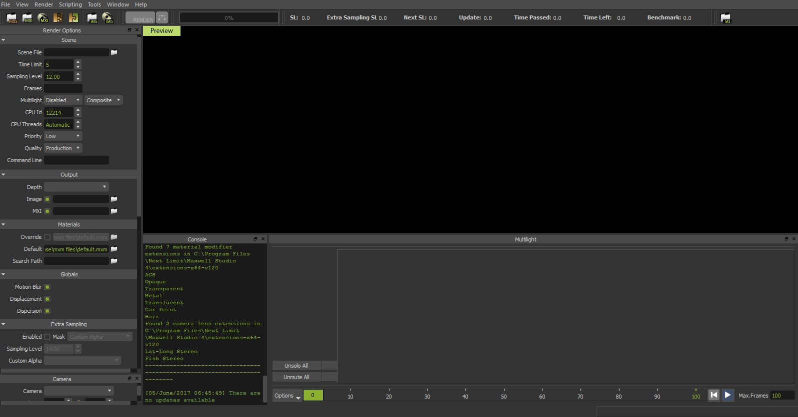
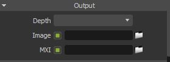

Denoise Next Limit Maxwell renders with Altus
---------------------------------------------

.. warning::

    This article is under construction and will be updated.  If you find any issues with the documentation please contact us at support@innobright.com

Overview
----------

Maxwell 4.1 and later comes with Altus integrated. `See MaxwellRender.com for more information`__.
Upgrade today!

__ http://www.maxwellrender.com/

.. include: overview-renderer.rst

Exporting AOVs
-----------------

Recommended List of AOVs to use with Altus:

+----------------+-----------------------+-------------------------------+
| **AOV type**   | **Altus Input Name:** | **V-Ray Render Element Name** |
+================+=======================+===============================+
| World Position | pos                   | Position                      |
+----------------+-----------------------+-------------------------------+
| Bump Normals   | nrm                   | Normals                       |
+----------------+-----------------------+-------------------------------+
| Visiblity      | vis                   | Shadows                       |
+----------------+-----------------------+-------------------------------+
| Albedo         | alb                   | Reflectance?                  |
+----------------+-----------------------+-------------------------------+
| Caustics       | cau (Optional)        | Caustics                      |
+----------------+-----------------------+-------------------------------+

How to Output AOVs that are compatible with Altus (from 3ds Max)
################################################################

First enable Maxwell as the current renderer in the to render settings.  Then select Maxwell Render Tab. Under the tab expand the rollout General Settings. And in the Engine rollout select Production.

A Separate Maxwell render window will open automatically when you click the render button.  You can stop the render from the top menu bar if needed.

Now go to Channels rollout. And select the necessary AOVs. Keep the extension as EXR.

Saving AOVs
###########

Under the Channel panel there is 'Output Mode' dropdown with the options Separate or embedded.  Selecting separate will output all the elements/AOVs.  Selecting embedded will merge all the elements/AOVs in single channel/output.

The render panel will contain the output settings.  You can define output directory here.

Exporting Two Buffers
----------------------

On the left side of Maxwell Renderer there is a scene panel.  In there is a CPU ID option. Use this to render images with different noise variance as required by Altus. Keep high difference in the values to produce best noise variance.

