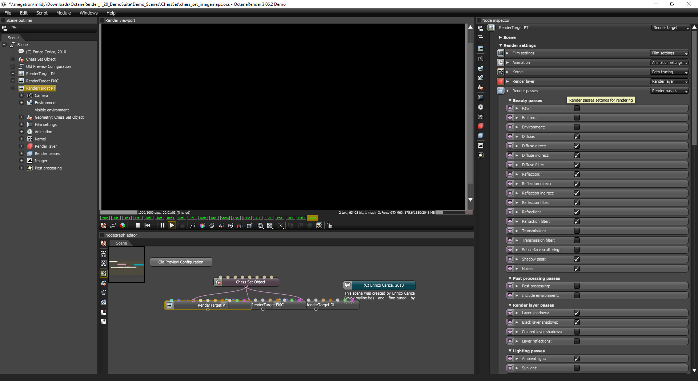
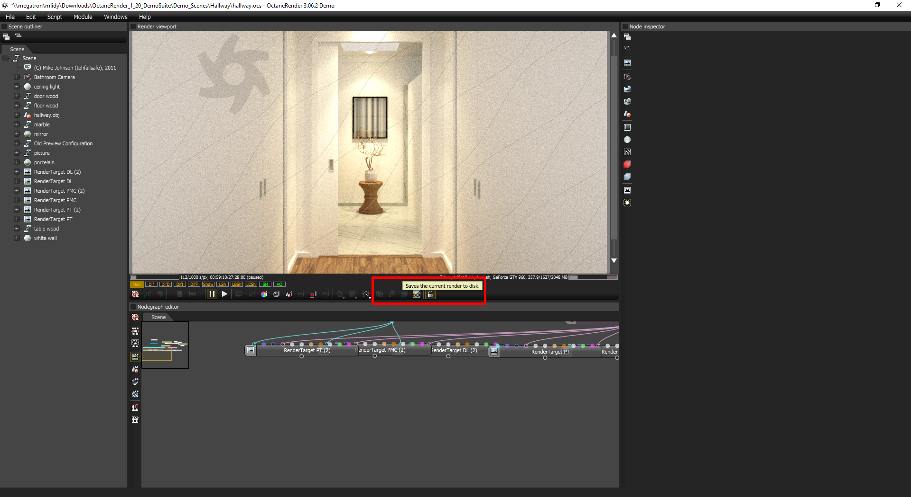
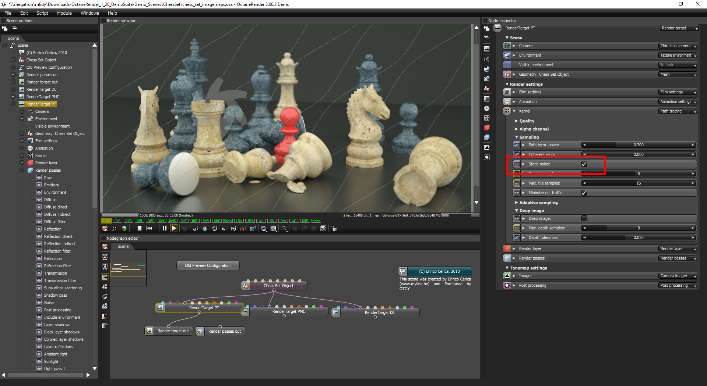
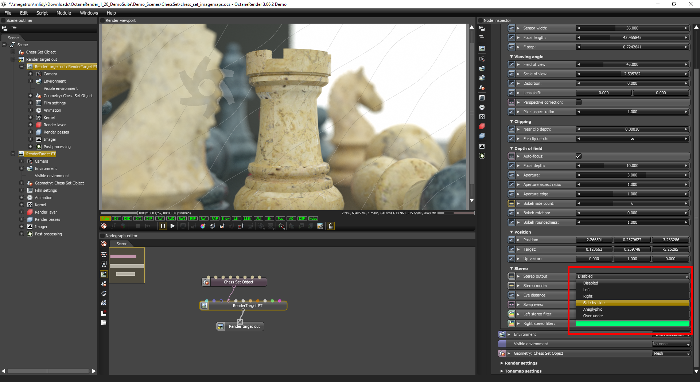

Denoise Otoy OctaneRender with Altus
====================================

.. warning::

    This article is under construction and will be updated.
    More information coming soon.

Overview
--------

.. include:: renderer-overview.rst

Exporting AOVs
--------------

Recommended List of AOVs to use with Altus:

+----------------+-----------------------+-------------------------------+
| **AOV type**   | **Altus Input Name**  | **Octane Render Pass Name**   |
+================+=======================+===============================+
| World Position | pos                   | Position                      |
+----------------+-----------------------+-------------------------------+
| Bump Normals   | nrm                   | Shading Normals               |
+----------------+-----------------------+-------------------------------+
| Visiblity      | vis                   |   Shadow / AO                 |
+----------------+-----------------------+-------------------------------+
| Albedo         | alb                   | Diffuse Filter                |
+----------------+-----------------------+-------------------------------+
| Reflection     | extra                 | Direct/Indirect Reflection    |
+----------------+-----------------------+-------------------------------+
| Caustics       | cau (Optional)        |      N/A                      |
+----------------+-----------------------+-------------------------------+

How to Output AOVs that are compatible with Altus (from OctaneRender)
#####################################################################

.. warning::

    Please upgrade to OctaneRender 3.06 or later, as earlier versions to not support generation of the visibility AOV.
    See :doc:`/inputs/recommended-aovs`.

Add AOVs to save from OctaneRender by opening the Render Settings Panel.  Then switch to the Render Passes tab. This is where all the available Render Passes will be listed. Add as many passes as you prefer.  For more information on render passes see https://help.otoy.com/hc/en-us/articles/115001714766-Render-Passes

Saving AOVs
###########

These added AOVs can be written to an EXR images along with the beauty render by using the buttons below the viewer:

Exporting Two Buffers
---------------------

Altus requires two renders (called buffers) of the same scene to denoise properly. Octane offers a few methods to render and save two buffers for Altus.

Render Twice
############

You can render twice and change the sample seed between renders.
Octane doesn't support changing the render seed directly, however, it has a setting :guilabel:`Static Noise` which locks the seed across frames when rendering animations.
:guilabel:`Static Noise` will select a different seed when toggled on/off.
Using that setting you can force octane into using a different seed by enabling :guilabel:`Static Noise` to render b0, and disable it to render b1.
This way each buffer will have a unique sample seed and noise pattern.

Before rendering b0, ensure that 'Static Noise' is turned on in the Kernel settings panel under the Render Settings:

Once the b0 render is completed, turn 'Static Noise' back off and start the second render for b1.

.. Note::

    If you want better integration with OTOY Octane request a sample seed option.

Render Once with Side-by-Side
#############################

You can render once using a side-by-side (stereo) camera rig and Altus will divide the image into two buffers. The camera's (eye) separation should be set to 0.0 so the left and right camera's have the same location and their renders will be identical except for the noise pattern.

.. warning::

    This is not creating stereoscopic imagery; it is a mechanism to create the two buffers Altus needs without having to render twice.

For more information on side-by-side stereo rendering in Octane: https://help.otoy.com/hc/en-us/articles/115001664266-Camera-Settings
