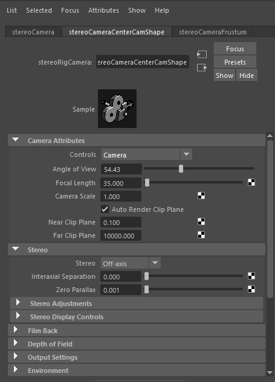

Denoise Pixar Renderman renders with Altus
==========================================

.. warning::

    This article is under construction and will be updated.

Overview
--------

.. include:: renderer-overview.rst

Exporting AOVs
-----------------

Recommended list of AOVs to use with Altus:

+----------------+-----------------------+-------------------------------+
| **AOV type**   | **Altus Input Name:** | **Renderman AOV Name**        |
+================+=======================+===============================+
| World Position | pos                   | P World                       |
+----------------+-----------------------+-------------------------------+
| Bump Normals   | nrm                   | N World                       |
+----------------+-----------------------+-------------------------------+
| Visiblity      | vis                   | Shadows                       |
+----------------+-----------------------+-------------------------------+
| Albedo         | alb                   | Albedo                        |
+----------------+-----------------------+-------------------------------+
| Reflection     | extra                 | Direct Specular               |
+----------------+-----------------------+-------------------------------+
| Caustics       | cau (Optional)        | Caustics                      |
+----------------+-----------------------+-------------------------------+

How to Output AOVs that are compatible with Altus from Maya
###########################################################

Add AOVs to save from Renderman (Maya) by opening the Render Settings Window:

.. image:: ./maya/Render_Settings_Location_Crop.png
   :scale: 60 %
   :align: center

Then switch to the Render Passes tab. This is where all the available Render Passes will be listed. Add as many passes as you prefer:

Saving AOVs
###########

These added AOVs can be written to separate EXR images or to a multi-layer (multi-channel) EXR image.

Exporting Two Buffers
---------------------

Altus requires two renders (called buffers) of the same scene to denoise properly.

Render Twice
############

The timeline can be used to get a different seed.  Each frame has its own seed assigned to it, so rendering frame 1 and frame 2 would results in 2 different seeds.

You can change the current frame in Maya by dragging the timeline at the bottom of the window.

Render Once with Stereo
#######################

.. warning::

    This is not creating stereoscopic imagery; it is a mechanism to create the two buffers Altus needs without having to render twice.

You can render once using a stereo camera rig and Altus will divide the image into two buffers. The camera's (eye) separation should be set to 0.0 so the left and right camera's have the same location and their renders will be identical except for the noise pattern.

The Maya Stereo Rig is a commonly used camera rig where the stereo effect can be controlled from the Attribute Editor of the center camera inside Maya:

More information coming soon.

