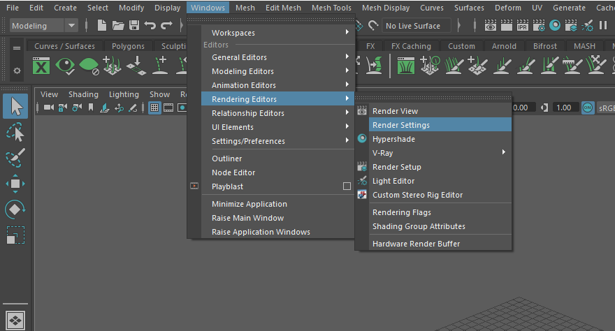

Denoise Pixar Renderman renders with Altus
==========================================

.. warning::

    This article is under construction and will be updated. If you find any issues with the documentation please contact us at support@innobright.com

Overview
--------

Altus Denoiser uses information between two rendered images to generate a high quality denoised image. This guide will explain how to setup and render the inputs to Altus. There are two concepts that Altus uses to generate denoised outputs:

AOVs (Arbitrary Output Variables) provide a way to render any arbitrary shaded component into different images. Typically renderers will only produce a final color for each pixel of the image, but you can break out renders into their component parts such as indirect lighting, diffuse color, reflections, shadows, mattes, etc. and save them as AOVs individually. The denoiser quality will improve with more AOVs given as inputs to Altus.

Two images (called buffers) must be generated for each image. It's important that each buffer is rendered with a different sample seed so that they will have unique noise patterns. The variance between the two buffers is what Altus uses to remove noise. Without variance, there is not enough information to remove noise.

For information on how to run Altus once the correct inputs have been created see :doc:`/usage`.

Exporting AOVs
-----------------

Recommended list of AOVs to use with Altus:

+----------------+-----------------------+-------------------------------+
| **AOV type**   | **Altus Input Name:** | **Renderman AOV Name**        |
+================+=======================+===============================+
| World Position | pos                   | P World                       |
+----------------+-----------------------+-------------------------------+
| Bump Normals   | nrm                   | N World                       |
+----------------+-----------------------+-------------------------------+
| Visiblity      | vis                   | Shadows                       |
+----------------+-----------------------+-------------------------------+
| Albedo         | alb                   | Albedo                        |
+----------------+-----------------------+-------------------------------+
| Reflection     | extra                 | Direct Specular               |
+----------------+-----------------------+-------------------------------+
| Caustics       | cau (Optional)        | Caustics                      |
+----------------+-----------------------+-------------------------------+

How to Output AOVs that are compatible with Altus from Maya
###########################################################

Add AOVs to save from Renderman (Maya) by opening the Render Settings Window:

Then switch to the Render Passes tab. This is where all the available Render Passes will be listed. Add as many passes as you prefer:

.. image:: ./renderman/Renderman_Passes.png
   :scale: 80 %
   :align: center

Saving AOVs
###########

These added AOVs can be written to separate EXR images or to a multi-layer (multi-channel) EXR image.

Exporting Two Buffers
---------------------

Altus requires two renders (called buffers) of the same scene to denoise properly.

Render Twice
############

The timeline can be used to get a different seed.  Each frame has its own seed assigned to it, so rendering frame 1 and frame 2 would results in 2 different seeds.

You can change the current frame in Maya by dragging the timeline at the bottom of the window.

.. image:: ./maya/Timeline.png
   :scale: 80 %
   :align: center

Render Once with Stereo
#######################

.. warning::

    This is not creating stereoscopic imagery; it is a mechanism to create the two buffers Altus needs without having to render twice.

You can render once using a stereo camera rig and Altus will divide the image into two buffers. The camera's (eye) separation should be set to 0.0 so the left and right camera's have the same location and their renders will be identical except for the noise pattern.

The Maya Stereo Rig is a commonly used camera rig where the stereo effect can be controlled from the Attribute Editor of the center camera inside Maya:

.. image:: ./maya/Stereo_maya.png
   :scale: 100 %
   :align: center

More information coming soon.

