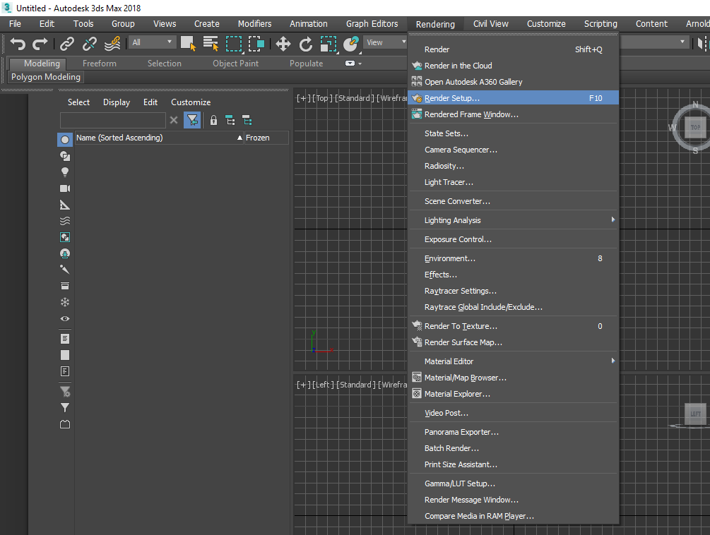
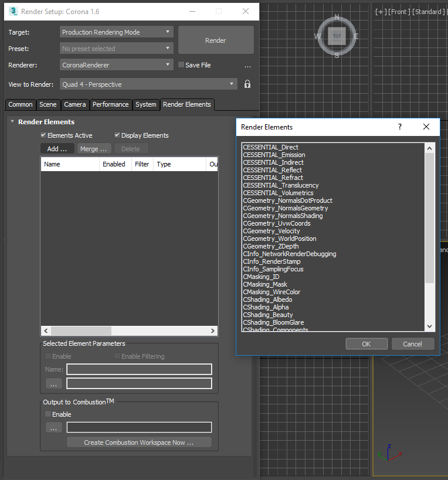
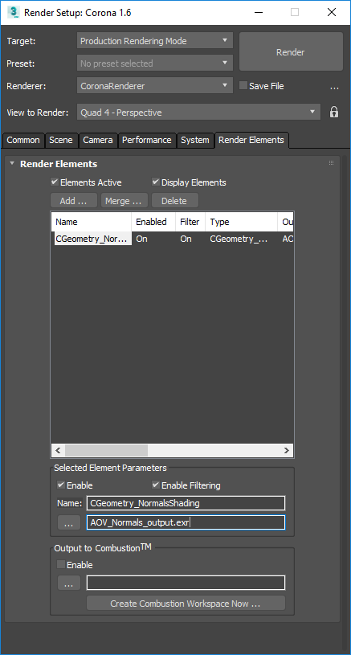
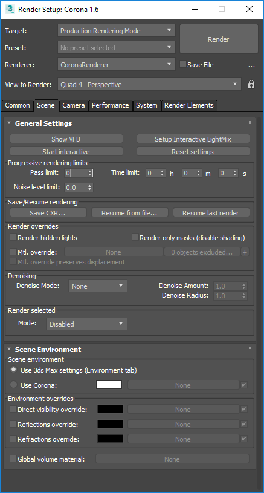
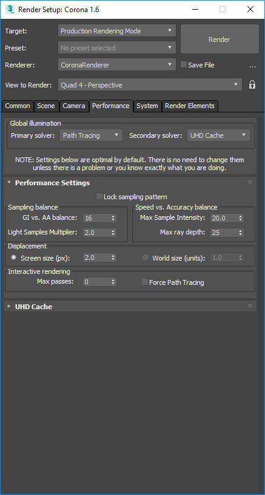

Denoise Render Legion Corona Render renders with Altus
------------------------------------------------------

.. warning::

    This tutorial is for older versions of Altus; configuring Corona and Altus are significantly easier now.

Overview
----------

Altus Denoiser uses information between two rendered images to generate a high quality denoised image. This guide will explain how to setup and render the inputs to Altus. There are two concepts that Altus uses to generate denoised outputs:

AOVs (Arbitrary Output Variables) provide a way to render any arbitrary shaded component into different images. Typically renderers will only produce a final color for each pixel of the image, but you can break out renders into their component parts such as indirect lighting, diffuse color, reflections, shadows, mattes, etc. and save them as AOVs individually. The denoiser quality will improve with more AOVs given as inputs to Altus.

Two images (called buffers) must be generated for each image. It's important that each buffer is rendered with a different sample seed so that they will have unique noise patterns. The variance between the two buffers is what Altus uses to remove noise. Without variance, there is not enough information to remove noise.

For information on how to run Altus once the correct inputs have been created visit:  help.innobright.com/usage/

Exporting AOVs
-----------------

Recommended List of AOVs to use with Altus:

+----------------+-----------------------+-------------------------------+ 
| **AOV type**   | **Altus Input Name:** | **Corona AOV Name**           | 
+================+=======================+===============================+ 
| World Position | pos:                  | CGeometry_WorldPosition       |
+----------------+-----------------------+-------------------------------+ 
| Bump Normals   | nrm:                  | CGeometry_NormalsShading      |
+----------------+-----------------------+-------------------------------+ 
| Visiblity      | vis:                  | CShading_Shadows              |
+----------------+-----------------------+-------------------------------+ 
| Albedo         | alb:                  | CShading_SourceColor          |
+----------------+-----------------------+-------------------------------+ 
| Reflection     | extra:                | CESSENTIAL_Reflect            |
+----------------+-----------------------+-------------------------------+ 
| Caustics       | cau (Optional)        | <Unkown>                      |
+----------------+-----------------------+-------------------------------+ 

**How to Output AOVs that are compatible with Altus (from 3ds Max)**

Add AOVs to save from Corona (3ds Max) by opening the Render Settings Window:

Then switch to the Render Passes tab. This is where all the available Render Passes will be listed.  Clicking "Add" will open a selection window with available passes:

Add as many passes as you prefer.  Once all passes have been added, you need to specify where to save each AOV:

Exporting Two Buffers
----------------------

Altus requires two renders (called buffers) of the same scene to denoise properly.

**Render Twice**

Corona can generate the two buffers by rendering twice and changing the seed between renders.

Under the "Scene" tab, set the "Pass limit" to half of the requested number of passes before filtering.

Under the "Performance" tab, in "Performance settings" ensure that the option “Lock the sampling pattern” is disabled ­ this way every time you hit the Render button the rendered image will be different ­ this is crucial for the denoising.

Now you are ready to render twice to get 2 renders with a different seed which Altus can denoise.

**Render Once with Stereo**

You can render once using a stereo camera rig and Altus will divide the image into two buffers. The camera's (eye) separation should be set to 0.0 so the left and right camera's have the same location and their renders will be identical except for the noise pattern.

.. Note::
    This section is under construction and will be updated.

More information coming soon.

To be able to use Altus you need to render your scene with Corona two times with several modifications of your render settings. So in 3ds Max, under the "Rendering" tab hit "Render setup" and make sure Corona is selected as active Renderer. Now you need to do the following changes:

* Under the "Scene" tab, set the "Pass limit" to half of the requested number of passes before filtering.
* Under the "System" tab uncheck "Render stamp" generation, so it won’t appear on saved renders.
* Under the "Performance" tab, in "Performance settings" uncheck the option "Lock the sampling pattern" ­ this way severy time you hit the Render button the rendered image will be different ­ this is crucial for the denoising.
* Add the following render elements under the "Render elements" tab using "Add" button:

  * CShading_SourceColor ­ make sure that in "Source (Raw) Color" dialog the "Diffuse" is checked, and save it to a file named "albedo_b0.exr" to the AltusWithCorona directory,
  * CGeometry_WorldPosition, and save it to "position_b0.exr" also to the AltusToCorona directory,
  * CShading_Shadows, save it to "shadows_b0.exr" also to the AltusToCorona directory,
  * CGeometry_NormalsShading, save it to "normals_b0.exr" also to the AltusToCorona directory,

* Save the Beauty pass to an EXR file: Under the "Common" tab, in "Render output" settings, check "Save file" and save it to "beauty_b0.exr" also to the AltusToCorona directory.

Render the scene with these settings once.

After that rename all the output images so they end with _b1.exr instead of _b0.exr. This way it won’t rewrite the rendered
images and we will have all the passes twice with different noise patterns.

AOV mapping:

* Saved beauty passes → rgb
* CGeometry_WorldPosition → pos
* CGeometry_NormalsShading → nrm​
* CShading_Shadows → vis​
* CShading_SourceColor → alb
