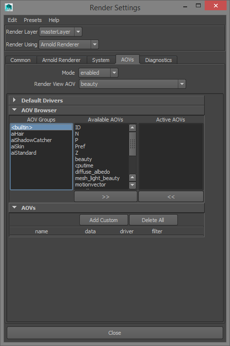
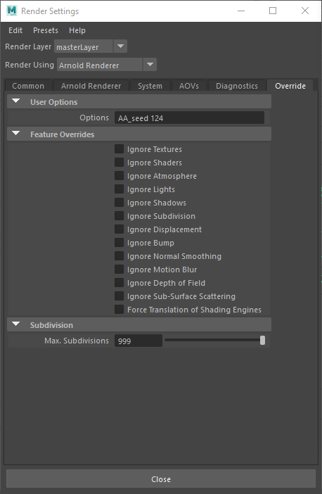

Denoise SolidAngle Arnold renders with Altus
============================================

.. warning::

    This article is under construction and will be updated.

Overview
--------

Altus Denoiser uses information between two rendered images to generate a high quality denoised image. This guide will explain how to setup and render the inputs to Altus. There are two concepts that Altus uses to generate denoised outputs:

AOVs provide a way to render any arbitrary shaded component into different images. Typically renderers will only produce a final color for each pixel of the image, but you can break out renders into their component parts such as indirect lighting, diffuse color, reflections, shadows, mattes, etc. and save them as AOVs individually. The denoiser quality will improve with more AOVs given as inputs to Altus.

Two images (called buffers) must be generated for each image. It's important that each buffer is rendered with a different sample seed so that they will have unique noise patterns. The variance between the two buffers is what Altus uses to remove noise. Without variance, there is not enough information to remove noise.

For information on how to run Altus once the correct inputs have been created see :doc:`/usage`.

Exporting AOVs
--------------

Recommended List of AOVs to use with Altus:

+----------------+-----------------------+-------------------------------+
| **AOV type**   | **Altus Input Name**  | **Arnold AOV Name**           |
+================+=======================+===============================+
| World Position | pos                   | P                             |
+----------------+-----------------------+-------------------------------+
| Bump Normals   | nrm                   | N                             |
+----------------+-----------------------+-------------------------------+
| Visiblity      | vis                   | Shadows                       |
+----------------+-----------------------+-------------------------------+
| Albedo         | alb                   | Diffuse                       |
+----------------+-----------------------+-------------------------------+
| Reflection     | extra                 | Reflection                    |
+----------------+-----------------------+-------------------------------+
| Caustics       | cau (Optional)        | Caustics                      |
+----------------+-----------------------+-------------------------------+

.. note::

    These AOVs can be produced with Arnold 4.2.16 and later; earlier versions did not support these AOVs by default, or had bugs during AOV generation.

How to Output AOVs that are compatible with Altus (from Maya)
#############################################################

Add AOVs to save from Maya by opening the Render Settings Window:

.. image:: ./maya/Render_Settings_Location_Crop.png
   :scale: 60 %
   :align: center

Then switch to the AOV tab. This is where all the available AOVs will be listed. Add as many AOVs as you prefer:  For more info on Arnold's AOVs see https://support.solidangle.com/display/AFMUG/AOVs.

Saving AOVs
###########

These added AOVs can be written to separate EXR images or to a multi-layer (multi-channel) EXR image. Both are compatible with Altus Denoiser. Arnold uses drivers to handle file output.

Exporting Two Buffers
---------------------

Altus requires two renders (called buffers) of the same scene to denoise properly. Arnold offers a few methods to render and save two buffers for Altus.

Render Twice
############

You can render twice and change the sample seed between renders. Arnold uses a parameter called ``AA_seed`` to determine which seed to use when rendering.  You can set ``AA_seed`` from Maya by using the User Options field:

The seed must be changed between the first and second render in order to get both renders with a different noise pattern.

Once rendering is complete, both renders must be saved to disk along with their AOVs for use with Altus.

Render Once with Stereo
#######################

.. warning::

    This is not creating stereoscopic imagery; it is a mechanism to create the two buffers Altus needs without having to render twice.

You can render once using a stereo camera rig and Altus will divide the image into two buffers. The camera's (eye) separation should be set to 0.0 so the left and right camera's have the same location and their renders will be identical except for the noise pattern.

The Maya Stereo Rig is a commonly used camera rig where the stereo effect can be controlled from the Attribute Editor of the center camera inside Maya:

.. image:: ./maya/Stereo_maya.png
   :scale: 80 %
   :align: center
