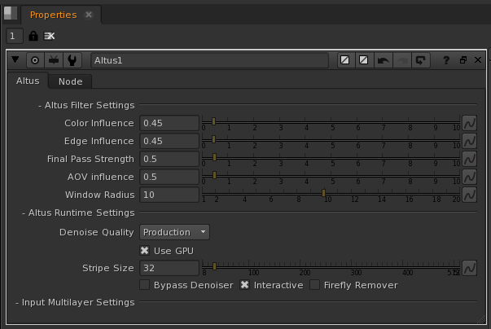

Denoise renders in Nuke with Altus
==================================

.. warning::

    Altus-Nuke is currently in BETA.  If you are interesting in testing the plugin then drop us a line at support@innobright.com.

    This article is under construction and will be updated.

Overview
--------

Altus-Nuke plugin integrates the denoiser directly into the Nuke Compositor as a new node.  This allows you to integrate Altus into your Nuke workflow and works for interactive and batch modes.  The plugin takes, as inputs, two renders to generate a high quality denoised image. This guide will explain how to setup and use the Altus-Nuke plugin.

Generally, Altus uses AOVs to enhance denoise quality and retain extra details.  AOVs provide a way to render any arbitrary shaded component into different images. Typically renderers will only produce a final color for each pixel of the image, but you can break out renders into their component parts such as indirect lighting, diffuse color, reflections, shadows, mattes, etc. and save them as AOVs individually. The denoiser quality will improve with more AOVs given as inputs to Altus.

Altus Denoiser Overview
-----------------------

.. include:: renderer-overview.rst

Install the Plugin 
------------------

.. Note::

	The Windows version of the plugin needs Visual C++ x64 redist. You should already have it since Nuke requires it.

.. Warning::

	Contact us at support@innobright.com for the packaged Altus-Nuke BETA plugin.

Nuke has to find the plugin before it can be loaded.  The following instructions will enable Nuke to find the plugin.

1) Once the install package is download, unzip to a folder.  Inside the zipped package there is a folder named "altus"

2) Copy the "altus" folder into  %HOMEPATH%/.nuke/ 

3) Create a file %HOMEPATH%/.nuke/init.py

4) Add the following to the init.py::

    import nuke
    nuke.pluginAddPath('${HOMEPATH}/.nuke/altus')

The path paramter need to be an absolute path to the altus directory. eg::

	C:\Users\Username\.nuke\altus
	or
	/home/Username/.nuke/altus

Using the Plugin
----------------

The Innobright/Altus Denoiser node only takes images as inputs.  The node have an arbitrary amount of input images for all AOV images.

Multi-layered
#############

If only two input images are given to Altus then it assumes it's a multi-layer image and will search it's channels for a position layer.  A position AOV must be supplied at a minimum.  For extra AOVs you can type the layer name in Altus parameters or use the buttons to open a list of available layers.  Any AOVs added will contribute to denoise quality.  When using multilayer, each layer used downstream from the node will be denoised.  Ie, if there is a multilayer image with 3 layers (beauty, shadow, normals) and I multiply shadow and beauty downstream then both those AOVs will be denoised.

The image below demonstrates a multi-layer image as an input to Altus Denoising node:

Multiple Images
###############

You can add multiple images instead of multilayered images by adding more than 2 input images.  The node expects the first 2 inputs are the b0, b1 image.  The next 2 inputs are position_b0 and position_b1.  Then, all inputs greater than 4 are treated as extra AOV inputs and must be passed in pairs.  These extra connections will be named "b0_AOV#" and "b1_AOV#" so that you can keep track of which AOVs are paired together.  There is a limit of 10 extra AOV pairs which can be connected but this limit can be raised.  I haven't implemented a way to add named AOVs like nrm, vis, alb, cau.  But if you pass all your AOVs as extra AOVs then you will get the same denoise quality and results.

The image below demonstrates a multiple images as inputs:

Plugin Settings
---------------

Below is an image of the settings panel for the Altus Denoiser node.  

Altus Filter settings:
 * Color Influence: Color sensitivity at high frequency details.  Low numbers give more detail, higher numbers will aggressively denoise.
 * Edge Influence: 	Color edge sensitivity.  Low numbers give more detail, higher numbers will aggressively denoise.
 * Final Pass Strength:		The final pass strength to remove residual noise.  Low numbers give more detail, higher numbers will aggressively denoise.
 * AOV influence: 	The amount of influence AOV images have towards denoise quality.  Low numbers give more detail, higher numbers will aggressively denoise.
 * Window Radius:  The overall constraint to the filter.  Larger numbers will increase quality at a cost of speed.  The default of 10 is a good balance. 

Altus Runtime Settings:
 * Denoise Quality:  	Toggles preview/production quality.  Preview is great for iterative workflows, production gives the best results.
 * Use GPU:		Toggles GPU/CPU mode.
 * Stripe Size:	The size of the stripe (horizontal tile) to send to Altus to denoise if Interactive is enabled.  Small stripes give faster results but take longer to denoise the image.
 * Bypass Denoiser:	Toggles the denoiser on/off.  If the denoiser is off then the noisy images will be passed along.
 * Interactive:		Toggles between denoising the entire image (faster) or to denoise stripes (slower but quicker previews as the scanlines are processed).
 * Firefly Remover:  Helps eliminate fireflies in the input image and denoised output. 

Altus Errors
------------

Any errors will be reported by Nuke at the top of the image viewer.  The image below shows an example error when an odd number of images are connected, which implies there is a missing image:

.. image:: ./nuke/nuke-error.png
   :scale: 80 %
   :align: center