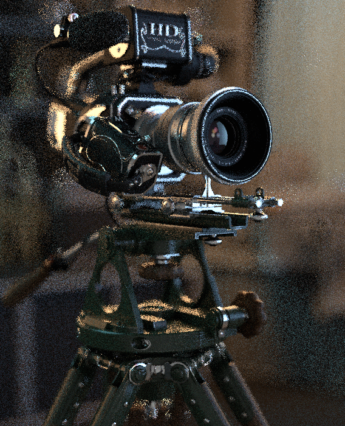
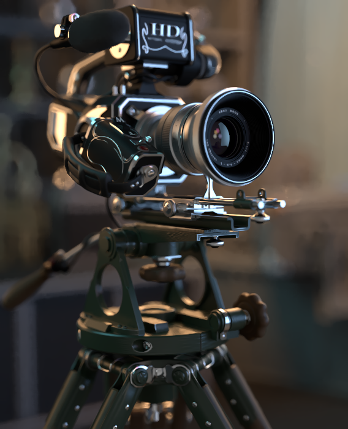

Buffers
-------

Altus needs two input images for each scene, which we call call buffers b0 and b1.  Each of these buffers must be rendered with a different sample seed such that noise varies between images. Altus will use the difference in noise patterns to remove noise while preserving detail.  Two buffers are **required**.

Internally Altus will combine the 2 buffers, providing a denoised output that matches the quality level of both buffers added together.  For example; if you want to denoise a render at 64spp (samples per pixel), then you can render twice at 32spp and Altus will output the equivalent of a denoised 64spp render.

Here is an image that alternates between 2 rendered images with a different seed.  Notice the noise pattern differs between the two images.  

Altus needs this variance in noise to work effectively. If you are getting noisy results from Altus then check that all AOVs have 2 buffers with different noise patterns.

If the inputs are given correctly to Altus, you should end up with this denoised result:

.. Note::
    For more information on generating/using two buffers correctly visit our pages:

    To generate two buffers visit: https://help.innobright.com/usage/basic-usage/

    To generate two buffers at once by using side-by-side images: https://help.innobright.com/inputs/side-by-side/

    For more information on how to generate two buffers with your favorite 3d package and render visit:  https://help.innobright.com/3rdparty/
