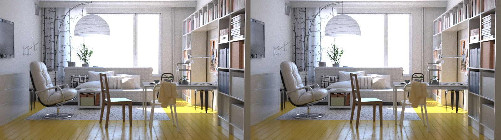

Side-by-side images
-------------------

In many places in Altus' documentation, side-by-side images are referred to as "stereo" images.
While these images are created using a renderer's stereoscopic image generation features, they are *not* actually stereoscopic images!  To avoid ambiguity we will refer to this type of image as side-by-side.

Side-by-Side images are offered as an alternative to rendering twice to provide Altus with two buffers containing different noise patterns.  You can render once using a stereo camera and Altus will interally divide the image into two buffers. The camera’s (eye) separation must be set to 0.0 so the left and right camera’s have the same location and their renders will be identical except for the noise pattern.

Here is an example of a side-by-side image:

To specify an input to altus is a side-by-side image simply use the set of CLI flags::

    --rgb-stereo= the file path of the beauty pass EXR image - the file must be a stereo (side-by-side) image. This option removes the need to specify '--rgb-0' or '--rgb-1' (optional).
    --pos-stereo= the file path of the world position pass EXR image. The file must be a stereo image. This option removes the need to specify '--pos-0' or '--pos-1' (optional).
    --nrm-stereo= the file path of the normal AOV EXR image - first buffer (optional
    --vis-stereo= the file path of the visibility AOV EXR image - first buffer (optional)
    --alb-stereo= the file path of the albedo AOV EXR image - first buffer (optional)
    --cau-stereo= the file path of the caustics AOV EXR image - first buffer (optional)
    --extra-stereo= the file path of an extra AOV EXR image - the file must be a stereo image. This option removes the need to specify '--extra-0' or '--extra-1' (optional).
    --additional-stereo=the file path of an additional AOV EXR image (optional)

Or when using a config file::

    rgb-stereo= the file path of the beauty pass EXR image - the file must be a stereo (side-by-side) image
    pos-stereo= the file path of the world position pass EXR image. - The file must be a stereo (side-by-side) image
    nrm-stereo= the file path of the normal AOV EXR image - the file must be a stereo (side-by-side) image
    vis-stereo= the file path of the visibility AOV EXR image - the file must be a stereo (side-by-side) image
    alb-stereo= the file path of the albedo AOV EXR image - the file must be a stereo (side-by-side) image
    cau-stereo= the file path of the caustics AOV EXR image - the file must be a stereo (side-by-side) image
    extra-stereo= the file path of an extra AOV EXR image - the file must be a stereo (side-by-side) image
    additional-stereo=the file path of an additional AOV EXR image the file must be a stereo (side-by-side) image
