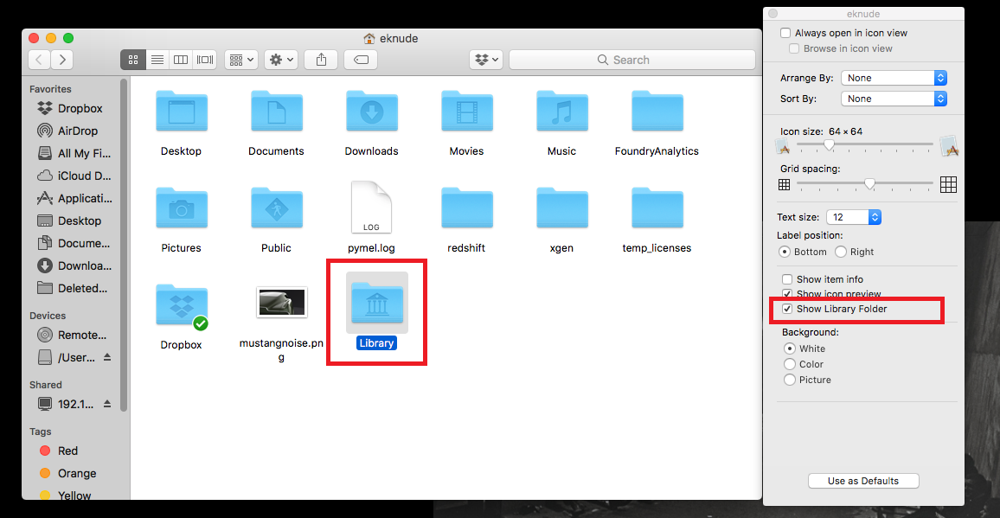
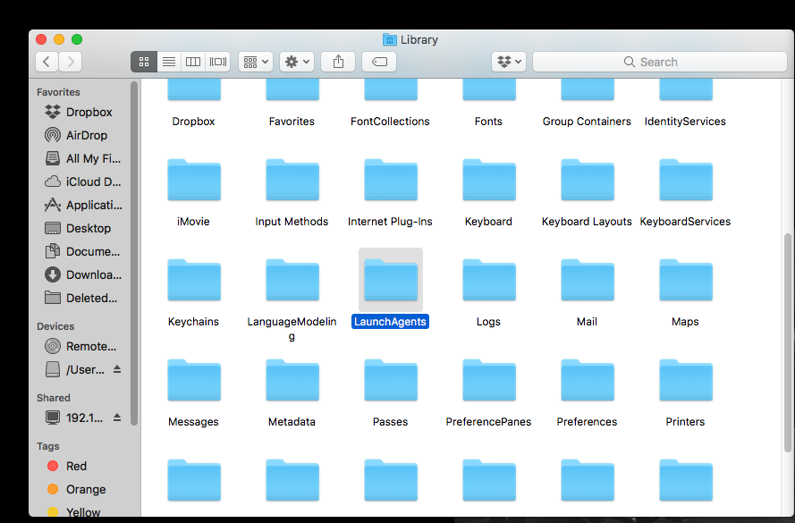
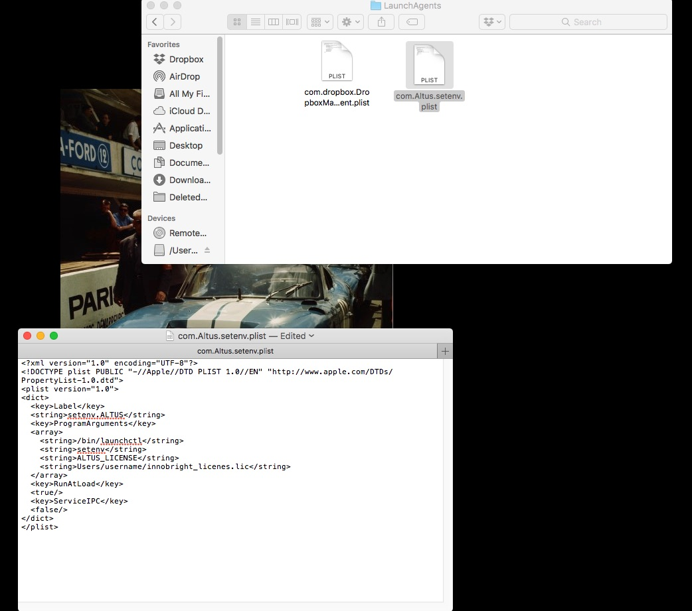

Using floating licenses on a Client Computer running Mac
--------------------------------------------------------

First, ensure that the RLM license server has been started correctly.  Visit here for more info on setting the ``RLM License Server`` :doc:`/licensing/setting-up-rlmd`.

Connecting to the license server
################################

Workstations must be configured so that it can find the license server and checkout licenses.  You do this by defining an environment variable ``ALTUS_LICENSE``. Altus Denoiser will look for the :envvar:`ALTUS_LICENSE` environment variable to point to the license server.  In order to automatically have Mac setup the enviroment variable on startup, you can use a plist file.

Here is an example of a plist file that points to the license server (for this example the license server's ip address is 192.168.1.1), you can copy this plist file::

   <?xml version="1.0" encoding="UTF-8"?>
   <!DOCTYPE plist PUBLIC "-//Apple//DTD PLIST 1.0//EN" "http://www.apple.com/DTDs/PropertyList-1.0.dtd">
   <plist version="1.0">
   <dict>
     <key>Label</key>
     <string>setenv.ALTUS</string>
     <key>ProgramArguments</key>
     <array>
       <string>/bin/launchctl</string>
       <string>setenv</string>
       <string>ALTUS_LICENSE</string>
       <string>192.168.1.1</string>
     </array>
     <key>RunAtLoad</key>
     <true/>
     <key>ServiceIPC</key>
     <false/>
   </dict>
   </plist>

You can `download the plist example file here`__.

__ http://shop.innobright.com/wp-content/uploads/2018/05/com.Altus_.setenv.floating.zip

Just unzip and copy the plist file to your LaunchAgents folder.

Given your setup there are three ways that you can set the enviroment variable to point to the license server:
    1) You can use the license server's ``ip address`` for a direct reference
    2) You can use a ``domain name`` if your license server has an internal domain name
    3) If you have machines that identify by name you can use the ``machine name``.

The enviroment variable will be in the form:

Variable name:  ALTUS_LICENSE

Variable value: port@ipaddress or port@domainname or port@machinename

Examples:: 
    
    5053@192.168.1.50 or 5053@optimusprime.innobright.com or 5053@optimusprime

Mac OS
#######

To add a permanent enviroment variable in Mac, first go to /Users/username/Library/LauchAgents/  This is where you'll create the .plist file.  By default, Mac hides the Library folder in your Home so right click on the finder window and select "Show View Options" to make the Library visible. 

Next, enter the LaunchAgents folder.  This directory will contain .plists that will run on startup.  This will ensure that the ALTUS_LICENSE enviroment varaible will be loaded everytime.

Finally, add a new .plist file named "com.Altus.setenv.plist" and copy the example .plist above.  Make sure to change the line: "<string>/Users/username/innobright_licenses.lic</string>" to match the path to the license file.  For example, if you have a .lic file in your /Users/username/Desktop/innobright_license.lic then the line should be:  <string>/Users/username/Desktop/innobright_license.lic</string>

Now restart the computer to have Mac load the enviroment variable when it starts up again.  Some programs may require a restart to reread the enviroment variables if they are reopened on startup. 

.. Note::

   For more information on setting up Enviroment Varaibles in MacOS visit:  http://www.dowdandassociates.com/blog/content/howto-set-an-environment-variable-in-mac-os-x-launchd-plist/