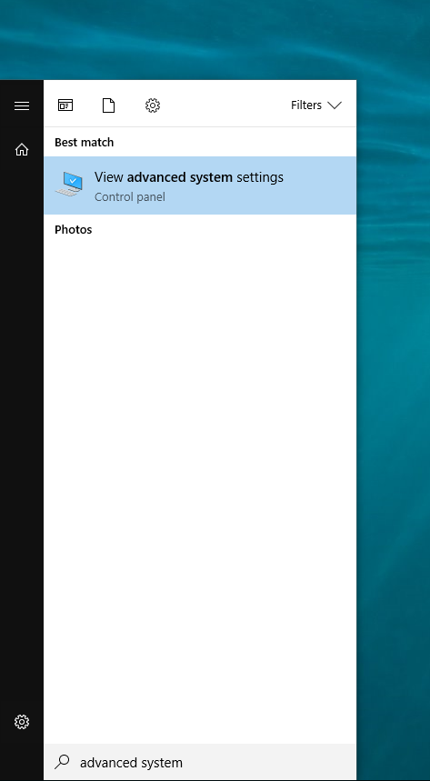
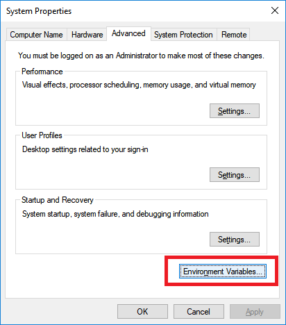

Using floating licenses on a Client Computer running Windows
------------------------------------------------------------

First, ensure that the RLM license server has been started correctly.  Visit here for more info on setting the ``RLM License Server`` :doc:`/licensing/setting-up-rlmd`.

Connecting to the license server
################################

Workstations must be configured so that it can find the license server and checkout licenses.  You do this by defining an environment variable ``ALTUS_LICENSE``.

Given your setup there are three ways that you can set the enviroment variable.
    1) You can use the license server's ip address for a direct reference
    2) You can use a domain name if your license server has an internal domain name
    3) If you have machines that identify by name you can use machine name.

The form of the enviroment variable will be:

name:  ALTUS_LICENSE
value:  port@ipaddress or port@domainname or port@machinename

.. Examples:: 
    
    5053@192.168.1.50 or 5053@optimusprime.innobright.com or 5053@localhost
    By default RLM license server will run on port 5053.

.. Note:: 
    If you do not know how to adjust your environment variables please reference this documentation.
    
    WINDOWS: http://www.computerhope.com/issues/ch000549.htm

    LINUX: http://www.cyberciti.biz/faq/set-environment-variable-linux/

Set the ALTUS_LICENSE environment variable
------------------------------------------

Windows
#######

To add a permanent enviroment variable in windows, first open the advanced system settings window by searching in "Advanced System Settings" in Window's start menu.

Then click "Enviroment Variables" to open the Enviroment Variables manager

This window will show the current User and System variables.  This is where you will add "ALTUS_LICENSE" variable.  To do that, click "New" under the system variables panel.

.. image:: ./licensing/new_system_var.png
   :scale: 100 %
   :align: center

The Variable name will be "ALTUS_LICENSE".  Since we are using a floating license, then Variable value will be the port@address as mentioned above.

Finally click "OK" and ensure that ALTUS_LICENSE has been added to the enviroment variable list under system variables.

.. image:: ./licensing/verify_floating.png
   :scale: 100 %
   :align: center

Some programs may require a restart to reread the enviroment variables.

For additional instructions for setting environment variables on Windows, please see `How to set the path and environment variables in Windows`__.

__ https://www.computerhope.com/issues/ch000549.htm
