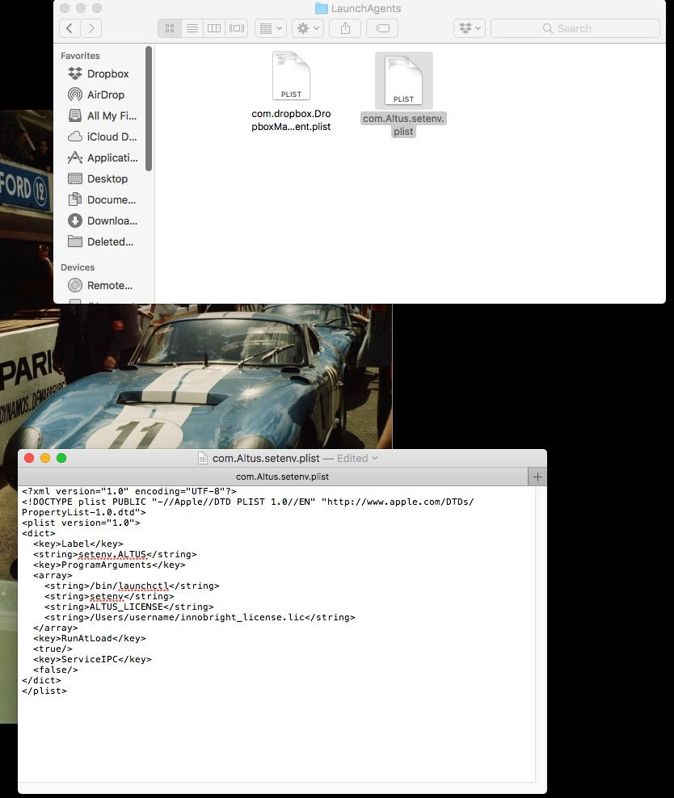

Node-locked licenses on Mac
===========================

Node-locked licenses lock your usage of Altus to a computer with a specific MAC address. If the MAC address changes, you will no longer be able to use your license.

.. Note::

   You do not need to run the RLM Licensing Server if you have a node-locked license.

Set the ALTUS_LICENSE environment variable
------------------------------------------

Altus Denoiser will look for the :envvar:`ALTUS_LICENSE` environment variable to point to a fully-qualified path to the license file so Altus can find it.  For example, if you place your licenses into :file:`C:\\Licenses`, and your license is called :file:`altus.lic`, then the value of the environment variable must be ``C:\Licenses\altus.lic``.

In order to automatically have Mac setup the enviroment variable on startup, you can create a ``plist`` file in the /Users/username/Library/LaunchAgents directory.

Here is an example of a plist file that points to the path of the license file (for this example the license file path is /Users/username/innobright_licenses.lic)::

   <?xml version="1.0" encoding="UTF-8"?>
   <!DOCTYPE plist PUBLIC "-//Apple//DTD PLIST 1.0//EN" "http://www.apple.com/DTDs/PropertyList-1.0.dtd">
   <plist version="1.0">
   <dict>
     <key>Label</key>
     <string>setenv.ALTUS</string>
     <key>ProgramArguments</key>
     <array>
       <string>/bin/launchctl</string>
       <string>setenv</string>
       <string>ALTUS_LICENSE</string>
       <string>/Users/username/innobright_licenses.lic</string>
     </array>
     <key>RunAtLoad</key>
     <true/>
     <key>ServiceIPC</key>
     <false/>
   </dict>
   </plist>

You can `download the plist example file here`__.

__ http://shop.innobright.com/wp-content/uploads/2018/05/com.Altus_.setenv.nodelocked.zip

Just unzip and copy the plist file to your LaunchAgents folder. Make sure to change the example path of `/Users/username/innobright_licenses.lic` to the actual path on your computer.

Mac OS
#######

To add a permanent enviroment variable in Mac, first go to /Users/username/Library/LauchAgents/  This is where you'll create the .plist file.  By default, Mac hides the Library folder in your Home so right click on the finder window and select "Show View Options" to make the Library visible. 

.. image:: ./licensing/mac_step_1.png
   :scale: 80 %
   :align: center

Next, enter the LaunchAgents folder.  This directory will contain .plists that will run on startup.  This will ensure that the ALTUS_LICENSE enviroment varaible will be loaded everytime.

.. image:: ./licensing/mac_step_2.png
   :scale: 60 %
   :align: center

Finally, add a new .plist file named ``com.Altus.setenv.plist`` and copy the example .plist above.  Make sure to change the line in the plist: ``/Users/username/innobright_licenses.lic`` to match the path to the license file.  For example, if you have a .lic file in your ``/Users/username/Desktop/innobright_license.lic`` then that section should be:  ``/Users/username/Desktop/innobright_license.lic``

Now restart the computer to have Mac load the enviroment variable when it starts up again.  Some programs may require a restart to reread the enviroment variables if they are reopened on startup. 

.. Note::

   For more information on setting up Enviroment Varaibles in MacOS visit:  http://www.dowdandassociates.com/blog/content/howto-set-an-environment-variable-in-mac-os-x-launchd-plist/