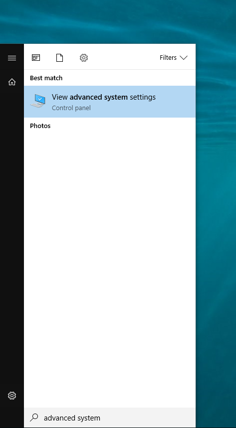
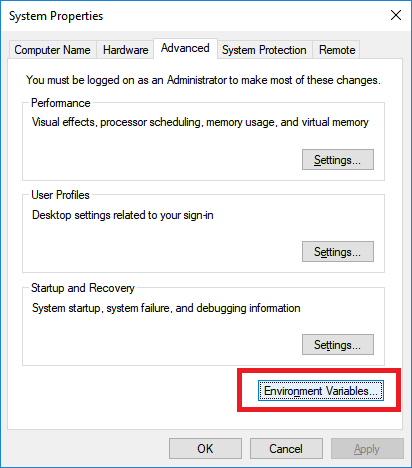
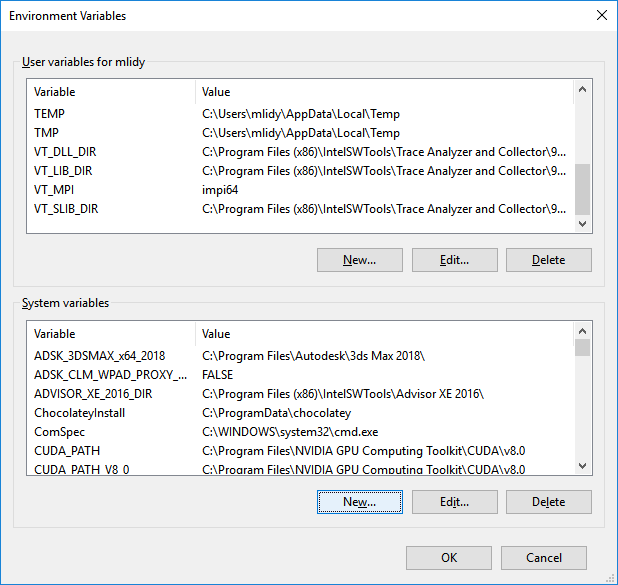
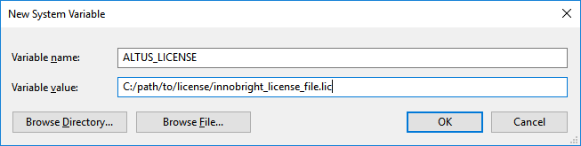
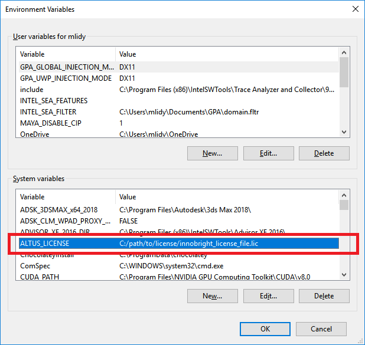

Node-locked licenses on Windows
===============================

Node-locked licenses lock your usage of Altus to a computer with a specific MAC address.
If the MAC address changes, you will no longer be able to use your license.

Node-locked licenses, unlike floating licenses, let you run as many copies of Altus as you'd like on that computer, only limited by the computing resources you have available (e.g. node-locked licenses are useful if you have multiple GPUs in a single computer).
You do not need to run the RLM Licensing Server if you have a node-locked license.

To use your node-locked license, you can do one of two things: place the license in the working directory (usually the same folder as Altus' executables), or set an environment variable pointing to the license.

Place license into same folder as Altus' executables
----------------------------------------------------

.. Note::

    This will only work for STANDALONE products of Altus Denoiser (Altus-Studio and Altus-ServerPro).  If you bought an integrated version of Altus (Redshift,Arnold,Nuke) then skip to the enviroment variable section below.

Place your license file in the same folder as the other Altus executables.

On Windows, by default this is :file:`C:\\Program Files\\Altus Denoiser\\bin`.

Altus will automatically find your node-locked license.

Set the ALTUS_LICENSE environment variable
------------------------------------------

If you wish to store your licenses in a separate directory from Altus, you can use the :envvar:`ALTUS_LICENSE` environment variable to point to fully-qualified path to the license file so Altus can find it.

For example, if you place your licenses into :file:`C:\\Licenses`, and your license is called :file:`altus.lic`, then the contents of your environment variable must be ``C:\Licenses\altus.lic``.

Windows
#######

To add a permanent enviroment variable in windows, first open the advanced system settings window by searching in "Advanced System Settings" in Window's start menu.

Then click "Enviroment Variables" to open the Enviroment Variables manager

This window will show the current User and System variables.  This is where you will add "ALTUS_LICENSE" variable.  To do that, click "New" under the system variables panel.

The Variable name will be "ALTUS_LICENSE".  Since we are using a node-locked license, then Variable value will be the path to the file on disk.  You can use the "Browse File" button to select the exact path.

Finally click "OK" and ensure that ALTUS_LICENSE has been added to the enviroment variable list under system variables.

Some programs may require a restart to reread the enviroment variables.

For additional instructions for setting environment variables on Windows, please see `How to set the path and environment variables in Windows`__.

__ https://www.computerhope.com/issues/ch000549.htm
