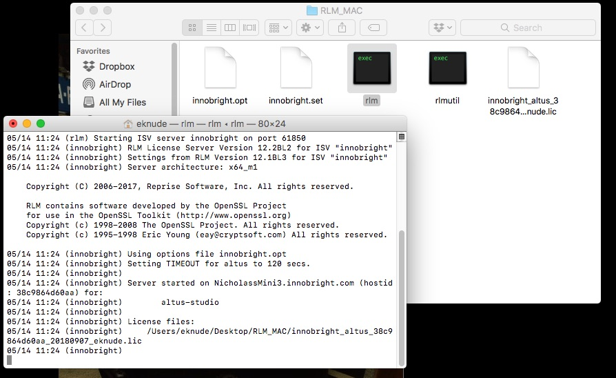

Setting up a new RLM licensing server
-------------------------------------

Installing the RLM licensing server
###################################

Download the license server `Mac`__. Extract the files from the zip and move them to a folder on your license server machine. The location of the folder is not important.

__ http://shop.innobright.com/wp-content/uploads/2018/05/RLM-12.1-Mac-Licensing-Package.zip
 

Add your Altus license file
###########################

Place the Altus Denoiser license file in same folder that contains the RLM license server files (This is the folder that contains the rlm executable).  View the image below for an example of how your rlm files and innobright license file should look:

Starting the RLM license server
###############################

The license server can be run from the command-line, or can be set up to run automatically on startup.

* On Mac Os, you can use a .plist to automatically start the license server.  You can create the ``plist`` file in the /Users/username/Library/LaunchAgents directory.

Here is an example of the plist file::

    <?xml version="1.0" encoding="UTF-8"?>
    <!DOCTYPE plist PUBLIC "-//Apple//DTD PLIST 1.0//EN" "http://www.apple.com/DTDs/PropertyList-1.0.dtd">
    <plist version="1.0">
    <dict>
      <key>Label</key>
      <string>com.ALTUS.rlm</string>
      <key>ProgramArguments</key>
      <array>
        <string>/Users/eknude/Desktop/RLM_MAC/rlm</string>
      </array>
      <key>RunAtLoad</key>
      <true/>
    </dict>
    </plist>

Once the license server has been setup, you can configure your workstations that will run Altus Denoiser (client computers) to access the license servers to request a license.

Next Steps
##########

Once the license server has been setup, now it's time to connect to it using your workstations (or the computer that will actually run Altus Denoiser).  Visit our help page for more info: :doc:`/licensing/floating-licenses/.