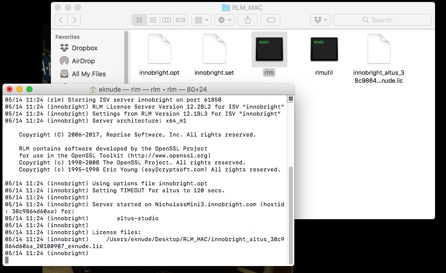

Setting up a new RLM licensing server for Windows
-------------------------------------------------

Installing the RLM licensing server
###################################

Download the `license server bundle for Windows`__. Extract the files from the zip and move them to a folder on your license server machine. The location of the folder is not important but remember it for later steps.

__ http://shop.innobright.com/wp-content/uploads/2018/03/RLM-12.1-Windows-Licensing-Package.zip

Add your Altus license file
###########################

Place the Altus Denoiser license file in same folder that contains the RLM license server files (This is the folder that contains the rlm executable).  View the image below for an example of how your rlm files and innobright license file should look:

Starting the RLM license server
###############################

The license server can be run from the command-line, or can be set up to run automatically on startup.  On Windows, you can add it as a windows service so that it automatically starts when you boot your server.

To install a service, open a shell/CMD/terminal in the unzipped license server directory.  Then run the following command: ``rlm -install_service -service_name RLM-Innobright``

Once the license server has been setup, you can configure your workstations that will run Altus Denoiser (client computers) to access the license servers to request a license.

Next Steps
##########

Once the license server has been setup, now it's time to connect to it using your workstations (or the computer that will actually run Altus Denoiser).  Visit our help page for more info: :doc:`/licensing/floating-licenses-windows/.