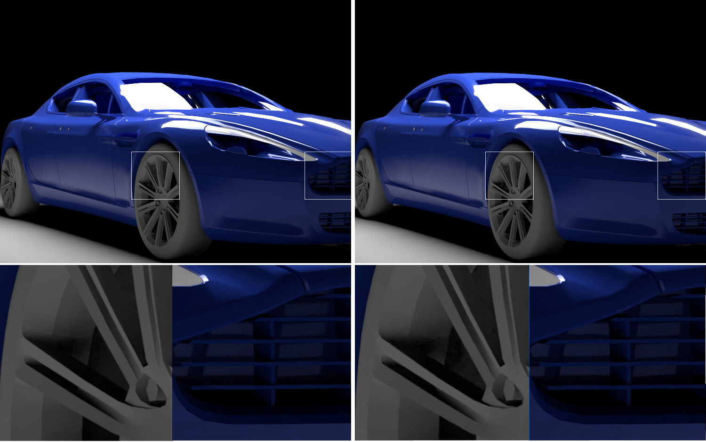
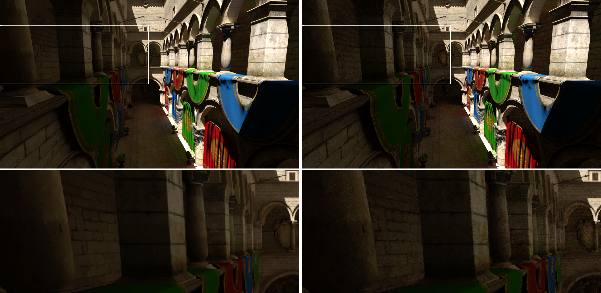
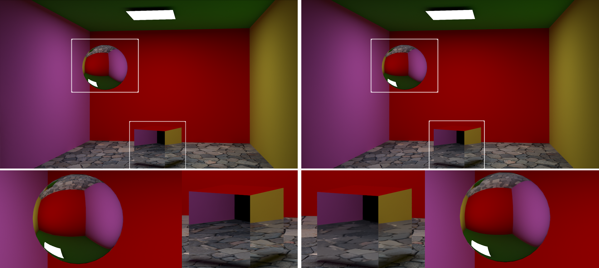
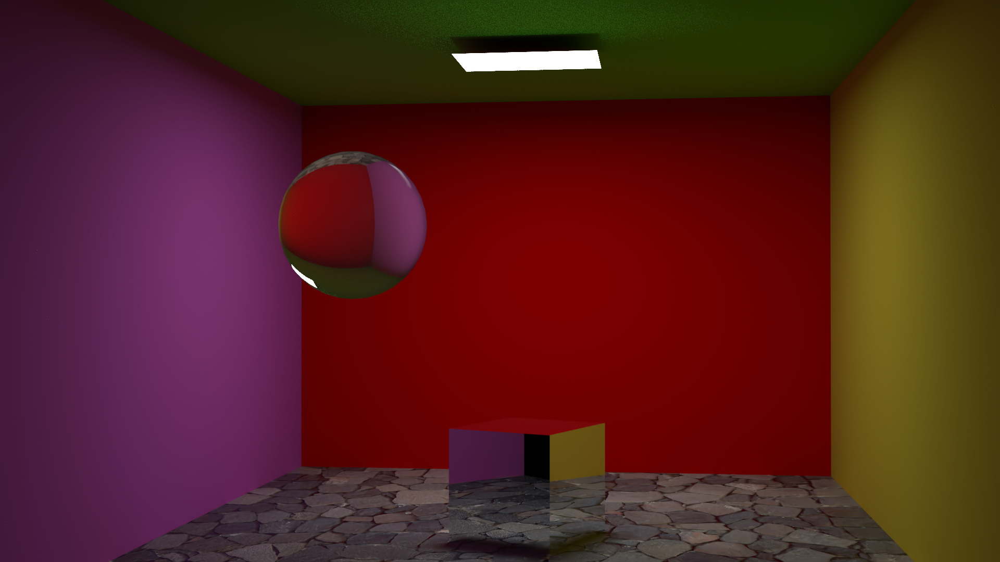

How Does Altus Compare?
-----------------------

Innobright’s Altus is the world’s first multi-platform, Monte Carlo render denoising system. We let you generate fast, noisy renders with smaller samples per pixel (SPP) and filter them to produce high quality images & animation. We give you the quality you want, in a fraction of the time.  Altus is a post-processing filter to remove noise from renders created with physically-based Monte Carlo rendering methods.
Most photorealistic renderers use this method of path generation;

Features
========

+-----------------------------+------------------------+--------------------------------+----------------------------------+--------------------------------+ 
| **FEATURE**                 | **Supported in Altus** | **VRay Denosier**              | **Corona Denosier**              | **RMan Denosier**              |
+=============================+========================+================================+==================================+================================+ 
| Standalone                  |        **Yes**         |              Yes               |              No                  |             Yes                |
+-----------------------------+------------------------+--------------------------------+----------------------------------+--------------------------------+ 
| GUI Option                  |        **Yes**         |              Yes               |              No                  |             Yes                |
+-----------------------------+------------------------+--------------------------------+----------------------------------+--------------------------------+ 
| Works with ANY PBR Renderer |        **Yes**         |              No                |              No                  |             No                 |
+-----------------------------+------------------------+--------------------------------+----------------------------------+--------------------------------+ 
| HW acceleration             |        **Yes**         |              Yes?              |              No                  |             Yes                |
+-----------------------------+------------------------+--------------------------------+----------------------------------+--------------------------------+ 
| GPU Support                 |        **Yes**         |              No                |              No                  |             No                 |
+-----------------------------+------------------------+--------------------------------+----------------------------------+--------------------------------+ 
| Animation Support           |        **Yes**         |              No                |              No                  |             Yes                |
+-----------------------------+------------------------+--------------------------------+----------------------------------+--------------------------------+ 
| Firefly Remover             |        **Yes**         |              No                |              Yes                 |             No                 |
+-----------------------------+------------------------+--------------------------------+----------------------------------+--------------------------------+ 
| Filter AOVs along with RGB  |        **Yes**         |              Yes               |              Yes                 |             Yes                |
+-----------------------------+------------------------+--------------------------------+----------------------------------+--------------------------------+ 
| Fast/Preview Mode           |        **Yes**         |              No                |              No                  |             No                 |
+-----------------------------+------------------------+--------------------------------+----------------------------------+--------------------------------+ 

Performance 
===========

.. Note::
    These numbers were collected on a single computer with the following specs:

    +------------+------------------------------------+--------------------------+--------------------------+--------------------------+
    | **OS**     | **CPU**                            | **RAM Memory**           | **GPU**                  |  **VRAM**                |
    +============+====================================+==========================+==========================+==========================+
    | Windows    |   Intel Core i7-4770 @3.10GHz      |      12GB                |  NVIDIA GeForce GTX 960  |    4GB                   |
    +------------+------------------------------------+--------------------------+--------------------------+--------------------------+

+--------------------+------------------------+--------------------------------+----------------------------------+----------------------------------+--------------------------------+
| **Image Size**     | **Altus Preview**      | **Altus Production**           |   **VRay Denosier**              | **Corona Denosier**              | **RMan Denosier**              |
+====================+========================+================================+==================================+==================================+================================+
| 3000x3000          |         01:43          |              09:36             |             3:04                 |           00:00                  |         11:52                  |
+--------------------+------------------------+--------------------------------+----------------------------------+----------------------------------+--------------------------------+
| 1920x1080          |         00:37          |              03:40             |             0:26                 |           00:00                  |         02:36                  |
+--------------------+------------------------+--------------------------------+----------------------------------+----------------------------------+--------------------------------+
|  960x540           |         00:09          |              00:54             |             0:07                 |           00:00                  |         00:44                  |
+--------------------+------------------------+--------------------------------+----------------------------------+----------------------------------+--------------------------------+

Quality vs PBR Denoisers
=================

Renderman
#########

   Left: Altus Denoiser   Right: Renderman Denoiser

.. Note::

   Quality Differences: Renderman has blotchy shadows near the tire rims and blotchy highlights on the grill.  

Corona
######

   Left: Altus Denoiser   Right: Corona Denoiser

.. Note::

   Quality Differences: Corona leaves residual noise in shadowed areas.

VRay
####

   Left: Altus Denoiser   Right: VRay Denoiser

.. Note::

   Quality Differences: VRay denoiser has trouble preserving detail in reflections.  VRay image has blury reflections on the cube and blurry refractions on the sphere.

Quality vs Image-space Denoisers
=================

.. Warning::  

    The following results are from two generic image-space denoisers which operate only on the RGB image and cannot include any AOV/feature information.  Often these denoisers are intended to clean up noise from film.  This means that these denoisers will be fast but will produce worse quality outputs.  All such comparisons will be unfair but are included for reference. 

Neat-Image
##########

   Neat-Image settings used: 100% reduction, 150% noise level

.. Note::

   Quality Differences: NeatImage denoiser was unable to remove the bright noise surrounding the ceiling light, even after using more extreme filter parameters. 

Revision FX DE:Noiser
#############

.. figure:: ./images/Cornell_Rev_Denoiser.png
   :scale: 150 %
   :align: center

.. Note::

   Quality Differences: Revision DE:noiser constantly overblured the image.