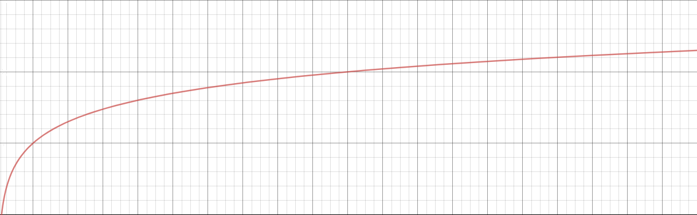

Why denoise?
------------

When rendering using Monte Carlo ray tracing, the image will initially be noisy and over time it will converge to a high quality noiseless image.
Unfortunately physically-based rendering in general can take a long time for a render to converge to a completely noise free image.
The render will need more samples in order for the image to converge and reduce noise.
Here is an image showing the noise reduction as you increase the samples per pixel.

However, increasing sample count suffers from diminishing returns.
Image quality typically improves by the square root of the number of samples;
this means that as sample counts get higher and higher, the difference in quality becomes more and more subtle.
You have to spend more time rendering to good to better, and even more time to go from better to great.

We can visualize the convergence with a graph showing the relationship between noise level and the number of samples taken in a render.

Denoising offers an algorithmic shortcut to this problem. It makes the best use of your sampling budget.

Altus is the world's first multi-platform denoiser specifically made for Monte Carlo renders. We make the most of your sampling budget, enabling you to generate fast, noisy renders with fewer samples per pixel, filtering them to produce high-quality images & animation in a fraction of the time.

Unlike other denoisers, we specifically operate on Monte Carlo renders, using information from the rendering process.
This means we're able to give you unparalleled quality that denoising simply was not able to before.

Unlike denoisers built into existing rendering software, we're not tied to specific vendors or pipelines.
With polyglot pipelines using different rendering software, you don't need to settle for denoising only available with certain renderers, or quality of denoising output varying from different implementations.
With Altus, you get a solution for your entire pipeline, with the ability to customize to your workflow.
