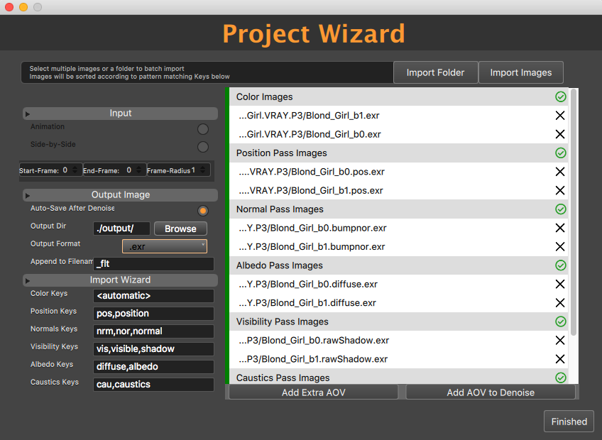
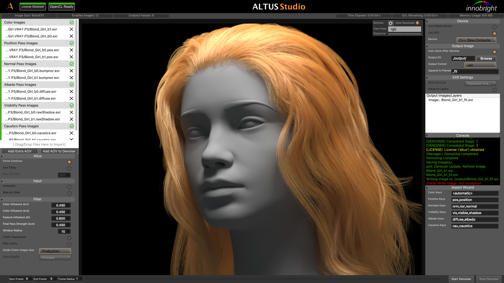

Altus Studio Layout
===================

The Altus GUI has a layout of the input settings on the left panel, the image viewer in the middle, and output settings on the right panel.  Animation settings can be found on the bottom.  The splash screen will open on startup and offers a way to quickly load previously saved/opened projects.

.. image:: ./gui/mainscreen.png
   :scale: 60 %
   :align: center

Project Wizard
==============

Altus Studio features a Project Wizard to aid in importing images to their correct passes for Denoising.  Here you’ll be asked to upload your two .EXR files per pass so that Altus can gather the information needed to denoise. Once imported you’ll be able to move the AOV’s by dragging and dropping to their rightful place.  The green checkmark indicator on the right of a pass will tell you that the information is correct and the pass will be used to denoise.  If you see a caution icon this means that Altus was not able to find the file on disk. The most common case of this error is from animations that were imported with an incorrect start and end frame.

Altus Studio Main Screen
========================

Below is an image of what your screen should look like after importing images into Altus Studio.  A notification of the status of your License will be determined with a green tab (licensed obtained) and a red tab (no license found).  An OpenCL indicator will let you know if Altus can run at the fastest speed possible.  There is other information displayed along the top such as image size, time elapsed and time remaining.

Input Panel
===========

On the left hand side of the program is the input panel.  Here you can adjust tiling size, toggle quality from preview to production along with other “Filter” parameters and manipulation.  If you were to import an animation scene and forgot to press it within the Project Wizard the option is still available under “Input”.

.. image:: ./gui/inputpanel.png
   :scale: 70 %
   :align: center

Image Display Options
=====================

Within the display screen of you’re denoised image you’ll notice a bar that has “View” and “Exposure” within it.  These have the ability for you to toggle exposure levels along with giving you the option to view all the AOV passes that were imported. The refresh button is available to force Altus to reload all images from disk. Note that changing the exposure level within the denoised panel will only be as a preview.  The file exposure will be preserved from the original .exr.

The image viewer also supports zooming in/out with the middle mouse wheel.  Right clicking the image will reset the view to default.  Middle click and drag will move the image's position between viewer.

.. image:: ./gui/exposureadjust.png
   :scale: 60 %
   :align: center

Output Panel
============

On the right side of your screen is the output panel.  This will allow you to give the denoised image its location to save to. The Console is there to notify the user of runtime information and how the program is performing. The Device tab allows you to toggle between your CPU/GPU device.

.. image:: ./gui/outputpanel.png
   :scale: 70 %
   :align: center