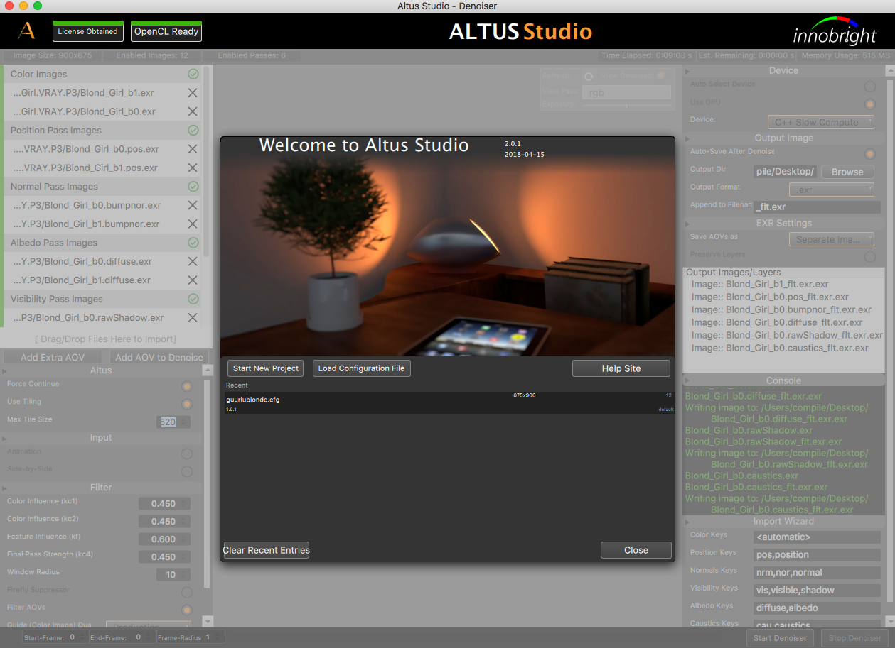

Altus Studio Layout
===================

The Altus GUI has a layout of the input settings on the left panel, the image viewer in the middle, and output settings on the right panel.  Animation settings can be found on the bottom.

Project Wizard
==============

Pictured below demonstrates Project Wizard.  Here you’ll be asked to upload your two .EXR files per pass so that Altus can gather the information needed to denoise. From there you’ll be able to move the AOV’s by dragging and dropping to their rightful place.  The green indication on the right will tell you that all the information is correct.  If you see a caution icon this means that Altus was not able to find the file on disk. In common case of the error is from animations that were imported with an incorrect start and end frame.

.. image:: ./gui/projectwizard.png
   :scale: 60 %
   :align: center

Altus Studio Main Screen
========================

Below is an image of what your screen should look like just after clicking “Finished” from the Project Wizard.  A notification of the status of your License will be determined with a green tab (licensed obtained) and a red tab (no license found).  There is other information displayed along the top such as image size, time elapsed and time remaining.

.. image:: ./gui/overview.png
   :scale: 60 %
   :align: center

Input Panel
===========

On the left hand side is the input panel.  Here you can adjust tile frame size, quality toggle from preview to production along with other “Filter” manipulation.  If you were to import an animation scene and forgot to press it within the Project Wizard the option is still available under “Input”.

Levels
======

Within the display screen of you’re denoised image you’ll notice a bar that has “View” and “Exposure” within it.  These have the ability for you to toggle exposure levels along with giving you the option to view all the AOV’s that was imported. The refresh button is available to force Altus to reload all images. Note that changing the exposure level within the denoised panel will only be as a preview.  The file will remain as original.

.. image:: ./gui/exposureadjust.png
   :scale: 60 %
   :align: center

Output Panel
============

On the right side of your screen is the output panel.  This will allow you to give the denoised image its location to save to. The Console is there to notify the user of useful information and how the program is performing. The Device tab allows you to toggle between your CPU/GPU device.

