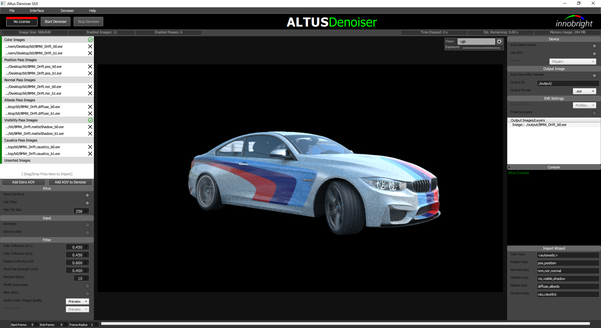
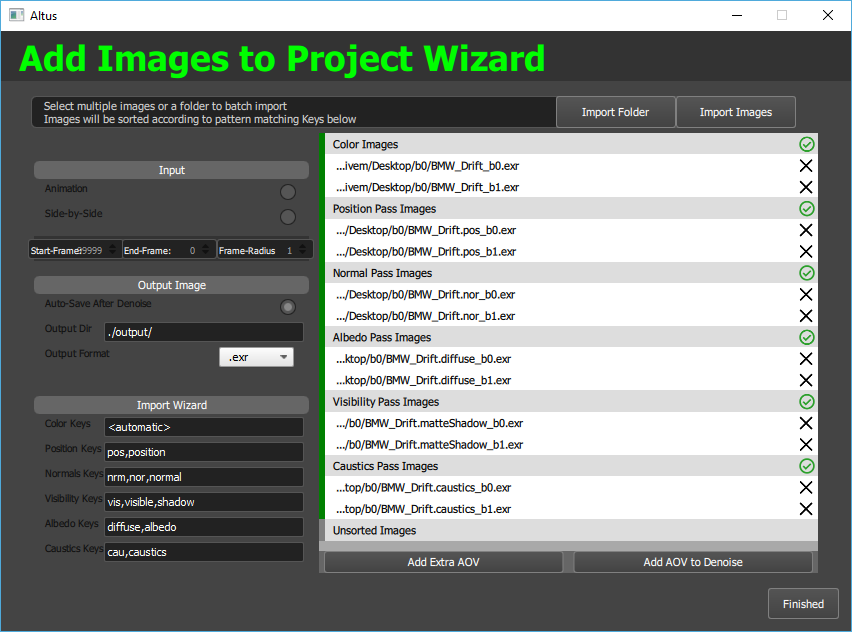

GUI
===

.. Note::

    This documentation is for the updated Altus 1.9.0+ GUI.

At this time, the Altus' Graphical User Interface (GUI) is available for Windows, Linux and MacOS.  

The GUI is for those who have trouble with using the Altus command line. Generally, we recommend that if you can use the command line directly, you use that instead.

Using the GUI
--------------

The Altus GUI has a layout of the input settings on the left panel, the image viewer in the middle, and output settings on the right panel.  Animation settings can be found on the bottom.

To denoise with the Altus GUI, fill in the inputs section on the top-left with all AOV images, then click "Start Denoiser".  You can add more inputs by drag/drop files into the input list, or by using the import wizard (add images to project).  To add extra AOV passes just clicking 'Add Extra AOV' or 'Add AOV to Denosier'.  Inputs can be rearranged by dragging.  For a list of recommended AOVs see :doc:`/inputs/recommended-aovs`.

All input passes support multi-layer and side-by-side (also known as stereo imagery, generated from a single seed) images. See :doc:`/inputs/side-by-side`.  Layers will be imported automatically and will be treated as a separate input in the inputs list.  See :doc:`/inputs/multichannel-exrs`.

Each input and pass has basic error checking visualized by the red/grey/green tab on the left side of the input.  If the entire pass is green, then it's valid and will be used in denoiser.  If it is grey or red, it's either disabled or incorrect.  A warning icon will appear on image inputs that point to files that dont exist.  Altus GUI automatically skips passes that are invalid.

Output images/layers are displayed in the right side panel and will update as Altus settings are changed for feedback.

.. Note::

    Altus will still denoise even if input boxes have red tabs.  It's displayed only to notify the user of a potential problem.  All red/grey inputs will be skipped while denoising and quality will be subpar.

Configuration files
-------------------

You can import config files into the GUI.  Click the 'Load (Config File)' button from the file menu-bar.  All AOV inputs will be created and settings will be updated to match the config file.  You can export config files from the GUI.  Once you are satisfied with the settings and added AOVs, click the 'Save (Config File)' or 'Save As' button from the menu-bar and specify the export cfg name.

Running Altus from the GUI
--------------------------

To begin denoising, ensure that the inputs and settings are correct.  Then click 'Start Denosier'.  Altus will display all updates and any errors in the Altus Console.  The top info-bar will display a progress bar denoting the progress on the current frame, the bottom animation-bar will display a progress bar denoting progress within the entire animation sequence.  Altus overlays a square indicator to display the tile that is currently being denoised.

.. image:: ./gui/GUI_Run_Denoise.png
   :scale: 60 %
   :align: center

Import Wizard
-------------

Altus GUI features an import wizard to simplify the import process.  To open click "Add Images" from the drop down file menu-bar.  The wizard displays commonly used settings and features an input sorter based on pattern matching.  All import settings are accessible from the settings.  

.. Note::
    
    We have 30 second walkthroughs on youtube.

    Watch them here:

    https://www.youtube.com/watch?v=ETY5f7xtQpo

    https://www.youtube.com/watch?v=6OmUxZPuom0

    https://www.youtube.com/watch?v=l9hTv4miCAk

Settings
--------

All settings are exposed in the panels.  Input settings are on the left panel and animation bar at the bottom.  Output settings are on the right panel.  The import wizard has pattern matching keys that can be changed.

Force Continue
##############

This option is displayed but not used in the GUI.  It will be loaded/saved from config files.  

Use Tiling
##########

This option enables/disables tiling in the GUI.  Tiling is always slower than denoising the entire frame at once, but it offers benifits of lower memory usage and quicker visual updates as each tile is denoised.  Combine with max-tile size to find the largest tile possible with your memory/VRAM restrictions.  

Animation
#########

This option will allow Altus to denoise in animation mode with temporal filtering enabled.  Enabling this option will cause all AOV paths to update with an automatically generated format specifier, eg. '####'.

If animation is enabled, then 'Start-Frame' 'End-Frame' must also be specified to avoid errors. 

'Frame-Radius' is the number of adjacent frames to look at when denoising animation sequences.  By default it is set to 1.

See :doc:`/usage/animation`.

Filter Settings
---------------

For more information on filter settings see :doc:`/usage/advanced-usage`.

Device Settings
###############

These 3 options allow users to select which compute device to use when Altus denoises.
You can select

1. Autoselect device only
2. Force to auto-selected GPU based on memory size
3. Manually select which compute device to use.

Output from Altus Settings
##########################

The GUI can set filter quality levels, preserve layers, and output preview or production filtered AOVs.

For more information on Altus output settings see :doc:`/usage/output-options`.

Known Issues
------------

Image size and memory size reporting is disabled in linux.
Occasionally the image viewer will not update after importing.
