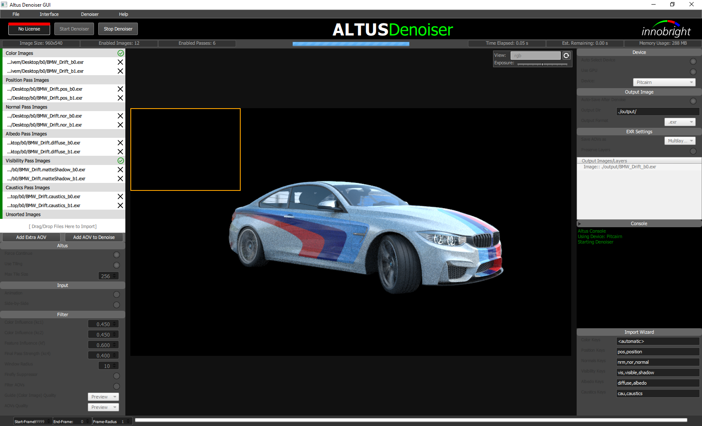

GUI
===

.. Note::

    This GUI was designed for demo purposes to evaluate Altus.  If you are using this GUI in a production setting, or have interest in a GUI that is more production oriented, then please drop us a line at [support contact here] so we can gauge interest and better support the production for that type of usage.

At this time, the Altus' Graphical User Interface (GUI) is only available for Windows.

The GUI is for those who have trouble with using the Altus command line. Generally, we recommend that if you can use the command line directly, you use that instead.

The first time you use the GUI it will open the License Wizard which will gather basic information like your innobright.com username and whether you plan to register Altus with a license or evaluate the product first.

Using the GUI
--------------

The Altus GUI is laid out with the focus on AOV inputs.

.. image:: ./gui/GUI_Layout.png
   :scale: 60 %
   :align: center

To denoise with the Altus GUI, fill in the image input boxes with their respective image paths and click run.  You can add more input boxes by clicking 'Add AOV' and selecting the type of AOV.  If you are unsure about the AOV type then select 'extra'.  For a list of recommended AOVs see :doc:`/inputs/recommended-aovs`.

To fill in the image paths, you can drag and drop your files into the file boxes, browse for files, type in the paths manually, or copy/paste from one box to another.  These input boxes support multi-layer (when enabled, the 'Select Layer' button to open the layer selection menu) and side-by-side (also known as stereo imagery, generated from a single seed) images. See :doc:`/inputs/side-by-side`.

Each input box has basic error checking visulized by the red or green tab on the left.  A green tab indicates both b0 and b1 are correct.  A red tab indicates there was some issue.  Hovering the mouse over the tab will show a tool tip explaining the error.

.. Note::

    Altus will still denoise even if input boxes have red tabs.  It's displayed only to notify the user of a potential problem.

To switch an AOV input to use side-by-side imagery click the option icon:

Configuration files
-------------------

You can import config files into the GUI.  Drag and drop the config file over the top header bar to import or click the 'Import' button from the menubar.  All AOV inputs will be created and settings will be updated to match the config file.
You can export config files from the GUI.  Once you are satesfied with the settings and added AOVs, click the 'Export' button from the menubar and specify the export cfg name.

Running Altus from the GUI
--------------------------

To begin denoising, ensure that the inputs and settings are correct.  Then click 'Run'.  Altus will open a log sidebar if "Display Log in GUI" is enabled, all updates and any errors will be printed to this log.  A progress window will open during denoising and will notify when denoising is complete.

Settings
--------

The settings side-bar can be extended by clicking 'Settings' in the menu.  The settings are sorted into 3 categories:  Input to Altus, Runtime Settings, Output from Altus.

Input Settings
--------------

Use Layers
##########

Enable this option when working with multilayer input EXRs.  Once enabled Altus will ask which layer to use when adding new images.  The format required for layers is "Filename.exr::layername".
See :doc:`/inputs/multichannel-exrs`.

Animation
#########

This option will allow Altus to denoise in animation mode with temporal filtering enabled.  Enabling this option will cause all AOV paths to update with an automaticly generated format specifier, eg. '%04d'.  Disabling this option will cause
the path to revert to the original apth without the format specifer.  Editing the path will cause the automaticly generated format specifier to revert back to the original path.  Once editing is complete the format specifier will auto update again.

You can also edit the paths and specify the format specifer manually.  Once this is done, Altus will be unable to revert back to the orignal file path when the Animation option is disabled.  Altus will not try to convert a path that already has a format specifier.

'Start-Frame' 'End-Frame'
These must be specified

'Frame-Radius' is the number of adjacent frames to look at when denoising animation sequences.  By default it is set to 1.

See :doc:`/usage/animation`.

Runtime Settings
----------------

Write Log to file
#################

This option enables writing to a log file that will be located in the specified output folder.

Display Log to File
###################

This option will enable a log window which is located on the right side-bar and will update as Altus executes.

Filter Settings
###############

For more information on filter settings see :doc:`/usage/advanced-usage`.

Select Compute Device
#####################

These 3 options allow users to select which compute device to use when Altus denoises.
You can select

1. use CPU only
2. run on an auto-selected GPU based on memory size
3. manually select which compute device to use.  These options are in the settings window.

By default "Use CPU" is enabled.  If "Use CPU" is disabled then "Auto Select GPU" will be used.  Finally if both options are disabled you will be able to select a device from a list populated by Altus.

Note: When using CUDA there will be only 1 platform. OpenCL could have many platforms.

Output from Altus Settings
##########################

The GUI can set filter quality levels, preserve layers, and output prefiltered, preview or production filtered AOVs.

For more information on Altus output settings see :doc:`/usage/output-options`.

Menu Bar
--------

Click ``Run`` to begin denoising.  A pop up window will notify if an error is enountered.

Click ``Reset`` to revert the GUI back to its default state.

Click ``Import`` to import a config file.

Click ``Export`` to export the current state of the GUI as a config file that is compatible with all Altus productions.

Click ``Settings`` to open the settings side-bar.

The GUI can show your current license status in the top right corner.
A green light means your license is valid.

Click ``?`` button to open a list of links to the help website.
